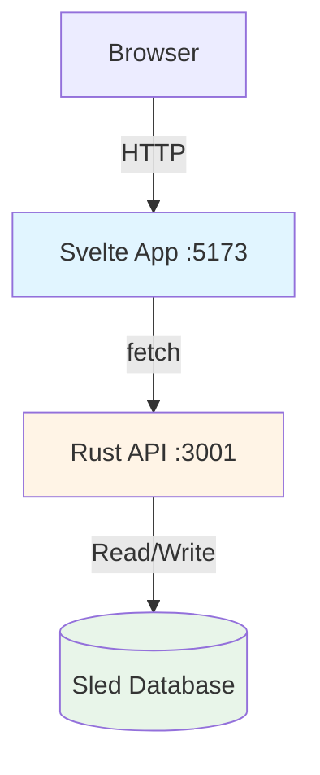

# Documentation Index

> Complete documentation for the Recipe App

## Getting Started

**New to the project?** Start here:

1. [Development Guide](./development.md) - How to run and develop the app
2. [Architecture Overview](./architecture.md#system-overview) - Understand the system design
3. [Frontend Guide](./frontend-guide.md#key-concepts) - Learn Svelte 5 patterns
4. [API Documentation](./api.md#endpoints) - Backend API reference

## Documentation Structure

```
docs/
├── README.md              # This file - navigation hub
├── development.md         # 🚀 Getting started, running locally
├── architecture.md        # 🏗️  System design and decisions
├── frontend-guide.md      # 💻 Svelte 5 patterns and best practices
├── api.md                 # 🔌 Backend API endpoints and usage
├── teacher-logs.md        # 📚 Teaching session history
└── coding-guideline.md    # 📏 Code standards and conventions
```

## Quick Reference

### For Developers

| Task | Documentation |
|------|---------------|
| Set up development environment | [Development Guide](./development.md#prerequisites) |
| Run the app locally | [Quick Start](./development.md#quick-start) |
| Understand the architecture | [Architecture](./architecture.md) |
| Learn Svelte 5 runes | [Frontend Guide - Runes](./frontend-guide.md#svelte-5-runes) |
| Call the API from frontend | [API - GET /recipes](./api.md#get-recipes) |
| Add a new component | [Frontend Guide - Component Patterns](./frontend-guide.md#component-patterns) |
| Debug issues | [Development - Debugging](./development.md#debugging) |
| Build for production | [Development - Production](./development.md#building-for-production) |

### For Backend Engineers

| Resource | Link |
|----------|------|
| API Endpoints | [api.md#endpoints](./api.md#endpoints) |
| Database Schema | [api.md#database-schema](./api.md#database-schema) |
| Rust Tech Stack | [architecture.md#technology-stack](./architecture.md#technology-stack) |
| Why Sled? | [architecture.md#why-embedded-database-sled](./architecture.md#why-embedded-database-sled) |
| Error Handling | [api.md#error-handling](./api.md#error-handling) |

### For Frontend Engineers

| Resource | Link |
|----------|------|
| Component Structure | [frontend-guide.md#project-structure](./frontend-guide.md#project-structure) |
| Svelte 5 Patterns | [frontend-guide.md#key-concepts](./frontend-guide.md#key-concepts) |
| State Management | [frontend-guide.md#state-management](./frontend-guide.md#state-management) |
| Context API | [frontend-guide.md#context-api-for-cross-component-communication](./frontend-guide.md#context-api-for-cross-component-communication) |
| Type Safety | [frontend-guide.md#type-safety](./frontend-guide.md#type-safety) |

### For Architects

| Resource | Link |
|----------|------|
| System Overview | [architecture.md#high-level-architecture](./architecture.md#high-level-architecture) |
| Data Flow | [architecture.md#data-flow](./architecture.md#data-flow) |
| Key Decisions | [architecture.md#key-architectural-decisions](./architecture.md#key-architectural-decisions) |
| Known Limitations | [architecture.md#known-limitations](./architecture.md#known-limitations) |
| Security Considerations | [architecture.md#security-considerations](./architecture.md#security-considerations) |

## Learning Path

### Understanding the Codebase

**Level 1: Basics** (Start here if new to project)
1. Read [Architecture Overview](./architecture.md#system-overview)
2. Follow [Quick Start](./development.md#quick-start) to run locally
3. Explore the running app at http://localhost:5173

**Level 2: Frontend Deep Dive**
1. Read [Svelte 5 Runes](./frontend-guide.md#svelte-5-runes)
2. Study [Component Details](./frontend-guide.md#component-details)
3. Review [Body.svelte teaching session](./teacher-logs.md#2026-03-31-1545---frontend---connecting-frontend-to-backend-api)

**Level 3: Backend Deep Dive**
1. Read [API Documentation](./api.md)
2. Understand [Data Persistence](./architecture.md#data-persistence)
3. Review [Backend teaching session](./teacher-logs.md#2026-03-31-1430---backend---rust-rest-api-with-axum-and-sled)

**Level 4: Advanced Topics**
1. Study [teacher-logs.md](./teacher-logs.md) for implementation rationale
2. Review [Key Architectural Decisions](./architecture.md#key-architectural-decisions)
3. Read [Known Limitations](./architecture.md#known-limitations) and propose improvements

## Teaching Logs

The [teacher-logs.md](./teacher-logs.md) file contains detailed teaching sessions that explain:

- **Why** decisions were made (not just what was implemented)
- **Trade-offs** between different approaches
- **Edge cases** and potential issues
- **Codebase connections** - what affects what
- **Concepts to own** - fundamental patterns to understand

### Recent Teaching Sessions

1. **[Frontend - Connecting to Backend API](./teacher-logs.md#2026-03-31-1545---frontend---connecting-frontend-to-backend-api)** (Mar 31, 15:45)
   - Migrating from static JSON to dynamic API fetching
   - Type system refactoring with shared interfaces
   - onMount() lifecycle and error handling

2. **[Backend - Rust REST API](./teacher-logs.md#2026-03-31-1430---backend---rust-rest-api-with-axum-and-sled)** (Mar 31, 14:30)
   - Building REST API with Axum and Sled
   - Automatic database seeding
   - CORS configuration and middleware

3. **[Frontend - Blur/Click Race Condition](./teacher-logs.md#2026-03-29-1700---frontend---blurclick-race-condition-fix)** (Mar 29, 17:00)
   - Browser event timing and async patterns
   - Delayed blur pattern for clickable dropdowns

4. **[Frontend - Svelte Context API](./teacher-logs.md#2026-03-29-1630---frontend---drawer-component-with-svelte-context)** (Mar 29, 16:30)
   - Cross-component communication without prop drilling
   - Context provider pattern

5. **[Frontend - Component Extraction](./teacher-logs.md#2026-03-29-1545---frontend---component-extraction)** (Mar 29, 15:45)
   - Presentation vs. logic separation
   - Component composition patterns

## Diagrams

### System Architecture



### Component Hierarchy

```
+page.svelte (root, context provider)
    │
    ├─▶ Sidebar.Provider
    │       ├─▶ AppSidebar
    │       └─▶ MainContent
    │               ├─▶ Header
    │               └─▶ Body
    │                       ├─▶ Favorites
    │                       └─▶ Recipes
    │
    └─▶ Drawer
```

## Contributing

Before making changes:

1. **Read**: [coding-guideline.md](./coding-guideline.md) for code standards
2. **Understand**: Review relevant documentation above
3. **Check**: Run type checks and linters before committing
4. **Document**: Update relevant docs if you change behavior
5. **Log**: If using `/teach` agent, teaching sessions auto-append to teacher-logs.md

## FAQ

### Where should I add new documentation?

| Type of Documentation | File |
|----------------------|------|
| New endpoint | [api.md](./api.md) |
| New component pattern | [frontend-guide.md](./frontend-guide.md) |
| Architectural decision | [architecture.md](./architecture.md) |
| Development workflow | [development.md](./development.md) |
| Teaching session | [teacher-logs.md](./teacher-logs.md) (auto-generated by `/teach` agent) |

### How do I update diagrams?

This documentation uses [Mermaid](https://mermaid.js.org/) for diagrams. Edit the Mermaid code blocks directly in the markdown files. GitHub and most editors render them automatically.

### Where are the code examples?

- **API examples**: [api.md#testing-the-api](./api.md#testing-the-api)
- **Frontend patterns**: [frontend-guide.md#common-patterns](./frontend-guide.md#common-patterns)
- **Complete code walkthroughs**: [teacher-logs.md](./teacher-logs.md)

---

## Related Files

- [.github/copilot-instructions.md](../.github/copilot-instructions.md) - GitHub Copilot project context
- [.github/agents/teacher.agent.md](../.github/agents/teacher.agent.md) - Teaching agent configuration
- [Root README.md](../README.md) - Project overview (to be updated)

---

*Last updated: 2026-03-31 | This documentation was generated from teacher session logs and codebase analysis*
