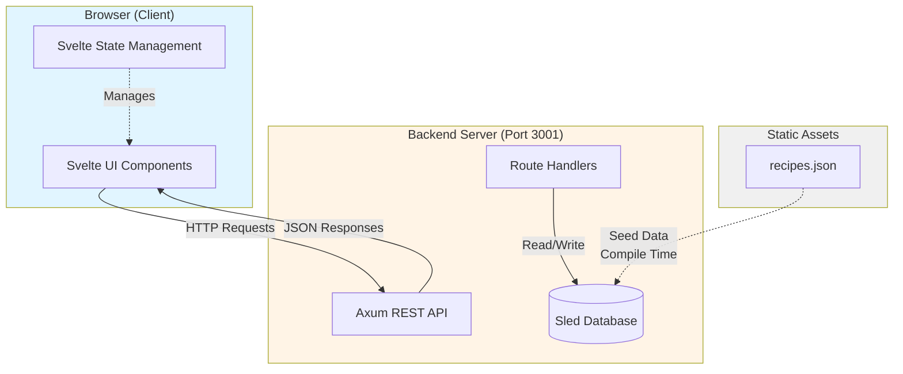
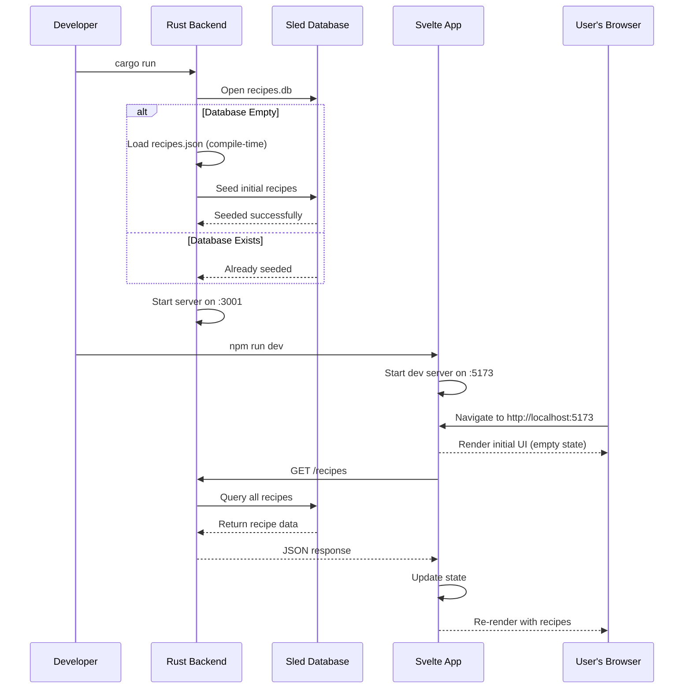

# Recipe App Architecture

> Full-stack recipe management application with Svelte 5 frontend and Rust/Axum backend

## System Overview

The Recipe App is a full-stack application that allows users to browse recipes, mark favorites, and organize them via drag-and-drop. The system consists of two main components:

- **Frontend**: SvelteKit application with TypeScript (port 5173)
- **Backend**: Rust REST API using Axum and Sled database (port 3001)

## High-Level Architecture



## Technology Stack

### Frontend
- **Framework**: SvelteKit with Svelte 5 (uses runes: `$state`, `$props`, `$bindable`)
- **Language**: TypeScript with strict type checking
- **UI Library**: shadcn-svelte components (Card, Sheet, Command, Sidebar)
- **Styling**: Tailwind CSS
- **Build Tool**: Vite
- **Features**:
  - Drag-and-drop with `svelte-dnd-action`
  - Context API for cross-component communication
  - Lifecycle hooks for data fetching (`onMount`)

### Backend
- **Framework**: Axum 0.7 (async web framework)
- **Runtime**: Tokio (async runtime)
- **Database**: Sled 0.34 (embedded NoSQL key-value store)
- **Serialization**: Serde + serde_json
- **Middleware**: Tower HTTP (CORS support)
- **Language**: Rust 2021 edition

## Data Flow

### Application Startup



### Recipe Retrieval

```
┌─────────────┐
│   Browser   │
└──────┬──────┘
       │ 1. onMount() fires
       ▼
┌─────────────┐
│ Body.svelte │ fetch("http://127.0.0.1:3001/recipes")
└──────┬──────┘
       │ 2. HTTP GET request
       ▼
┌─────────────┐
│ Axum Router │ /recipes endpoint
└──────┬──────┘
       │ 3. Extract State
       ▼
┌─────────────┐
│get_recipes()│ Handler function
└──────┬──────┘
       │ 4. Iterate database
       ▼
┌─────────────┐
│  Sled DB    │ Key-value store
└──────┬──────┘
       │ 5. Deserialize recipes
       ▼
┌─────────────┐
│JSON Response│ Vec<Recipe>
└──────┬──────┘
       │ 6. Parse & render
       ▼
┌─────────────┐
│   Browser   │ Updated UI
└─────────────┘
```

## Component Architecture

### Backend Components

```
packages/backend/
├── Cargo.toml          # Dependencies (axum, tokio, sled, serde)
├── src/
│   └── main.rs         # All API code
└── recipes.db/         # Sled database (gitignored)
    └── [binary files]

Key Structures:
- Recipe struct (id, title, description, image, is_favorite)
- AppState (holds Sled database handle)
- Router with CORS middleware
```

**Endpoints:**
- `GET /recipes` - Returns all recipes sorted by ID
- `POST /recipes` - Creates new recipe with auto-generated ID

### Frontend Components

```
packages/frontend/src/
├── routes/
│   ├── +layout.svelte       # Root layout
│   └── +page.svelte         # Main page (context provider)
├── lib/
│   ├── models/
│   │   └── recipes.interface.ts  # Shared Recipe type
│   ├── components/
│   │   ├── Header.svelte         # Search & Add Recipe button
│   │   ├── Sidebar.svelte        # Navigation sidebar
│   │   ├── Main.svelte           # Content wrapper
│   │   ├── Body/
│   │   │   ├── Body.svelte       # Data fetching & orchestration
│   │   │   ├── Favorites.svelte  # Favorites grid (drag-drop)
│   │   │   └── Recipes.svelte    # All recipes grid (drag-drop)
│   │   └── Drawer/
│   │       └── Drawer.svelte     # Add Recipe form
│   └── components/ui/            # shadcn components
└── resources/
    └── recipes.json              # Seed data (backend only)
```

**Component Hierarchy:**

```
+page.svelte (context provider, drawer state)
    │
    ├── Context: searchQuery = { get value(), set value() }
    │           (Reactive state shared across Header + Body)
    │
    ├── Context: openDrawer = () => { drawerOpen = true }
    │           (Function shared across Header + Sidebar)
    │
    ├─▶ Sidebar.Provider
    │       │
    │       ├─▶ AppSidebar (consumes openDrawer context)
    │       │       └─ "Add Recipe" button
    │       │
    │       └─▶ MainContent
    │               ├─▶ Header (consumes openDrawer & searchQuery contexts)
    │               │       ├─ Search input (bind:value={searchContext.value})
    │               │       └─ "Add Recipe" button
    │               │
    │               └─▶ Body (consumes searchQuery context, fetches data)
    │                       ├─ items = $state<Recipe[]>([])         (source)
    │                       ├─ favorites = $state<Recipe[]>([])     (source)
    │                       ├─ filteredItems = $derived(...)        (computed)
    │                       ├─ filteredFavorites = $derived(...)    (computed)
    │                       │
    │                       ├─▶ Favorites(favorites={filteredFavorites})
    │                       │       └─ Displays filtered favorite cards
    │                       │
    │                       └─▶ Recipes(items={filteredItems})
    │                               └─ Displays filtered recipe cards
    │
    └─▶ Drawer (bind:open to drawer state)
            └─▶ Sheet (UI primitive)
```

## Key Architectural Decisions

### Why Embedded Database (Sled)?

**Decision**: Use Sled instead of PostgreSQL/MongoDB

**Rationale**:
- Zero configuration - no separate database server
- Perfect for prototyping and learning
- Persistent storage across restarts
- File-based (recipes.db directory)
- Fast key-value operations

**Trade-offs**:
- Single-machine only (can't scale horizontally)
- Less mature than traditional databases
- Limited query capabilities (no SQL)

### Why Svelte Context API?

**Decision**: Use Context API for drawer state and search query instead of prop drilling

**Rationale**:
- Drawer can be opened from multiple locations (Header, Sidebar)
- Search query needs to flow from Header (input) to Body (filtering) without passing through MainContent
- Avoids passing `openDrawer` and `searchQuery` through every intermediate component
- Cleaner component signatures
- Decouples unrelated components

**Pattern 1: Function Context** (for actions)
```typescript
// Provider (parent)
setContext("openDrawer", () => { drawerOpen = true });

// Consumer (any descendant)
const openDrawer = getContext<() => void>("openDrawer");
```

**Pattern 2: Getter/Setter Context** (for reactive state)
```typescript
// Provider - enables two-way binding
let searchQuery = $state("");
setContext("searchQuery", {
    get value() { return searchQuery },
    set value(v) { searchQuery = v }
});

// Consumer 1 (Header) - writes
const searchContext = getContext<{ value: string }>("searchQuery");
<input bind:value={searchContext.value} />

// Consumer 2 (Body) - reads reactively
let filteredItems = $derived(
    searchContext.value.trim() === "" ? items : items.filter(...)
);
```

**Why getter/setter?**
- Enables `bind:value` to work across component boundaries
- Maintains reactivity for `$derived` in consuming components
- Single source of truth without global state

### Why $derived for Filtering?

**Decision**: Use `$derived` rune for filtered recipe arrays instead of `$effect` or manual updates

**Rationale**:
- Automatically recomputes when `searchQuery` or `items` changes
- No manual dependency tracking needed
- Memoized: only recalculates when dependencies actually change
- Type-safe and explicit
- Read-only computed values prevent accidental mutations

**Pattern**:
```typescript
let items = $state<Recipe[]>([]);  // Source of truth (mutable)
const searchContext = getContext<{ value: string }>("searchQuery");

let filteredItems = $derived(  // Derived view (read-only)
    searchContext.value.trim() === ""
        ? items
        : items.filter(recipe => 
            recipe.title.toLowerCase().includes(searchContext.value.toLowerCase())
          )
);
```

**Why not $effect?**
- `$effect` is for side effects (API calls, logging), not computed values
- `$derived` is optimized for this pattern: automatically reactive, memoized

**Trade-offs**:
- Filtering runs on every keystroke (fine for <100 items)
- For 1000+ items, consider debouncing the search input
- Client-side only: can't search fields not loaded (descriptions, ingredients)

### Why Centralized Type Definitions?

**Decision**: Extract Recipe interface to `models/recipes.interface.ts`

**Rationale**:
- Single source of truth for types
- Easier to maintain consistency with backend
- Scales better as more types are added
- Follows Single Responsibility Principle

**File Organization**:
```
lib/
├── models/           # Type definitions
│   └── *.interface.ts
├── services/         # API calls (future)
├── components/       # UI components
└── utils/            # Helpers
```

### Why onMount() for Data Fetching?

**Decision**: Fetch recipes in `onMount()` lifecycle hook

**Rationale**:
- Runs once when component mounts
- Client-side only (won't run during SSR)
- Async-friendly (can use await)
- Automatic cleanup on unmount

**Alternative Rejected**: Top-level await would block component rendering and fail during server-side rendering.

## Data Persistence

### Backend Seed Strategy

**First Run**:
1. Backend starts, opens `recipes.db`
2. Checks if database is empty (`db.len() > 0`)
3. If empty, loads `recipes.json` via `include_str!()` (compile-time)
4. Parses JSON and inserts each recipe with key pattern `recipe:{id}`
5. Logs success message

**Subsequent Runs**:
1. Database already contains data, skip seeding
2. Existing recipes persist from previous session

**Important**: Changes to `recipes.json` won't reflect in database unless you delete `recipes.db` to force re-seed.

### Database Schema

**Key Pattern**: `recipe:{id}` (e.g., `recipe:1`, `recipe:2`)

**Value**: JSON-serialized Recipe struct
```json
{
  "id": 1,
  "title": "Spaghetti Bolognese",
  "description": "A classic Italian meat sauce pasta.",
  "image": "https://loremflickr.com/600/400/spaghetti,bolognese",
  "isFavorite": false
}
```

## Security Considerations

⚠️ **CORS Configuration**: Currently allows ALL origins (`allow_origin(Any)`). This is fine for development but **must be restricted in production**:

```rust
// Production-ready CORS
let cors = CorsLayer::new()
    .allow_origin("https://yourdomain.com".parse::<HeaderValue>().unwrap());
```

⚠️ **No Authentication**: API endpoints are publicly accessible. Add authentication before deploying.

⚠️ **No Input Validation**: Backend accepts any Recipe data. Add validation for production.

## Performance Characteristics

### Backend
- **Database**: Sled uses B-tree structure, O(log n) lookups
- **Async**: Tokio handles concurrent requests efficiently
- **Memory**: Database loads into memory, fast reads

### Frontend
- **Initial Load**: Single HTTP request for all recipes
- **Rendering**: Svelte compiles to efficient vanilla JS
- **Reactivity**: Svelte runes provide fine-grained reactivity
- **Drag-Drop**: svelte-dnd-action uses DOM manipulation, minimal overhead

## Known Limitations

1. **No error UI**: Frontend logs errors to console but doesn't inform user
2. **No loading state**: User sees blank screen while fetching
3. **Hardcoded URL**: API URL is not configurable via environment variables
4. **No pagination**: All recipes load at once (fine for small datasets)
5. **Race condition**: Concurrent POSTs may generate duplicate IDs
6. **No optimistic updates**: UI doesn't update until backend responds
7. **Client-side search only**: Search filters only loaded recipes by title; can't search descriptions or ingredients, no fuzzy matching
8. **No search debouncing**: Filters run on every keystroke (fine for <100 items, may need optimization at scale)

See [teacher-logs.md](./teacher-logs.md) for detailed discussions of these issues and potential solutions.

---

*Last updated: 2026-03-31 | Source: Real-time search implementation and teacher session logs*
