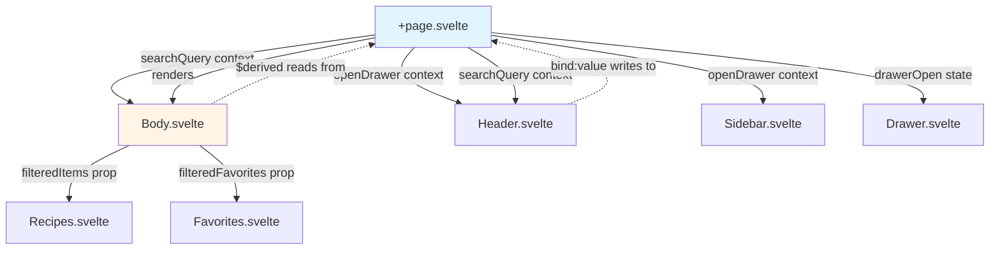
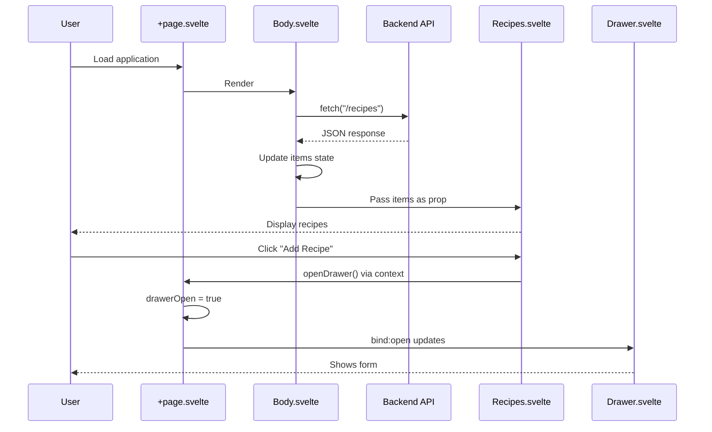

# Frontend Development Guide

> Building recipe UI with SvelteKit and Svelte 5

## Overview

The frontend is a SvelteKit application using Svelte 5's new runes API (`$state`, `$props`, `$bindable`). It provides a responsive recipe browsing interface with drag-and-drop organization, favorites management, and the ability to add new recipes.

## Tech Stack

- **Framework**: SvelteKit (full-stack Svelte framework)
- **UI**: Svelte 5 with runes-based reactivity
- **Language**: TypeScript (strict mode)
- **Styling**: Tailwind CSS
- **Components**: shadcn-svelte (Card, Sheet, Command, Sidebar)
- **Build Tool**: Vite
- **Testing**: Vitest (unit tests in `src/lib/vitest-examples/`)

## Project Structure

```
packages/frontend/
├── src/
│   ├── routes/                    # SvelteKit routing
│   │   ├── +layout.svelte         # Root layout
│   │   ├── +page.svelte           # Home page (context provider)
│   │   └── layout.css             # Global styles
│   ├── lib/
│   │   ├── models/                # TypeScript interfaces
│   │   │   └── recipes.interface.ts
│   │   ├── components/            # Application components
│   │   │   ├── Header.svelte      # App header with search
│   │   │   ├── Sidebar.svelte     # Navigation sidebar
│   │   │   ├── Main.svelte        # Content wrapper
│   │   │   ├── Body/              # Recipe display components
│   │   │   │   ├── Body.svelte    # Data orchestrator
│   │   │   │   ├── Favorites.svelte
│   │   │   │   └── Recipes.svelte
│   │   │   └── Drawer/            # Add recipe form
│   │   │       └── Drawer.svelte
│   │   ├── components/ui/         # shadcn-svelte primitives
│   │   │   ├── card/
│   │   │   ├── sheet/
│   │   │   ├── command/
│   │   │   └── sidebar/
│   │   ├── hooks/                 # Svelte utilities
│   │   │   └── is-mobile.svelte.ts
│   │   └── utils.ts               # Helper functions
│   ├── resources/
│   │   └── recipes.json           # Seed data (backend only)
│   ├── app.html                   # HTML template
│   └── app.d.ts                   # Type definitions
├── static/                        # Static assets
├── svelte.config.js               # SvelteKit config
├── vite.config.ts                 # Vite config
├── tsconfig.json                  # TypeScript config
└── package.json                   # Dependencies
```

## Key Concepts

### Svelte 5 Runes

Svelte 5 introduces **runes** - special compiler directives that replace the old reactivity system.

#### $state

Declares reactive state that triggers re-renders when changed.

```typescript
// OLD (Svelte 4):
let count = 0;

// NEW (Svelte 5):
let count = $state(0);
```

**With TypeScript**:
```typescript
// Must type empty arrays/objects explicitly
let items = $state<Recipe[]>([]);  // ✅ Correct
let items = $state([]);            // ❌ TypeScript error: never[]
```

**In the codebase**:
```typescript
// Body.svelte
let items = $state<Recipe[]>([]);
let favorites = $state<Recipe[]>([]);
```

#### $props

Declares component props with TypeScript typing.

```typescript
// OLD (Svelte 4):
export let items;

// NEW (Svelte 5):
interface Props {
    items: Recipe[];
}
let { items }: Props = $props();
```

**In the codebase**:
```typescript
// Recipes.svelte
interface Props {
    items: Recipe[];
    handleConsider: (e: CustomEvent) => void;
    handleFinalize: (e: CustomEvent) => void;
}
let { items, handleConsider, handleFinalize }: Props = $props();
```

#### $bindable

Creates two-way binding between parent and child.

```typescript
// Child component
let { value = $bindable(0) }: { value: number } = $props();

// Parent component
<ChildComponent bind:value={count} />
// Now both parent and child can modify 'count'
```

**In the codebase**:
```typescript
// Drawer.svelte
let { open = $bindable(false) }: Props = $props();

// +page.svelte
<Drawer bind:open={drawerOpen} />
```

#### $derived

Declares computed state that automatically updates when dependencies change.

```typescript
// OLD (Svelte 4):
$: doubled = count * 2;

// NEW (Svelte 5):
let doubled = $derived(count * 2);
```

**With complex logic**:
```typescript
let searchQuery = $state("");
let items = $state<Recipe[]>([...]);

// Automatically recomputes when searchQuery or items changes
let filteredItems = $derived(
    searchQuery.trim() === ""
        ? items
        : items.filter(recipe => 
            recipe.title.toLowerCase().includes(searchQuery.toLowerCase())
          )
);
```

**In the codebase**:
```typescript
// Body.svelte - Filters recipes based on search input
const searchContext = getContext<{ value: string }>("searchQuery");

let filteredItems = $derived(
    searchContext.value.trim() === ""
        ? items
        : items.filter((recipe) =>
            recipe.title.toLowerCase().includes(searchContext.value.toLowerCase())
          )
);

let filteredFavorites = $derived(
    searchContext.value.trim() === ""
        ? favorites
        : favorites.filter((recipe) =>
            recipe.title.toLowerCase().includes(searchContext.value.toLowerCase())
          )
);
```

**Why $derived over $effect?**
- `$derived` is for **computed values** (derived state)
- `$effect` is for **side effects** (logging, API calls, subscriptions)
- Derived values are automatically memoized and only recalculate when dependencies change

### Component Patterns

#### Data Fetching with onMount

Use `onMount()` lifecycle hook for API calls.

```typescript
import { onMount } from "svelte";

let data = $state<Recipe[]>([]);

onMount(async () => {
    const response = await fetch("http://127.0.0.1:3001/recipes");
    const result = await response.json();
    data = result;
});
```

**Why onMount?**
- Runs only in browser (not during SSR)
- Async-friendly
- Automatic cleanup on unmount

**In the codebase**: See [Body.svelte](../packages/frontend/src/lib/components/Body/Body.svelte)

#### Context API for Cross-Component Communication

Avoid prop drilling by using Svelte's Context API.

**Pattern 1: Function Context** (for actions)
```typescript
// Provider (parent component)
import { setContext } from "svelte";

let drawerOpen = $state(false);
setContext("openDrawer", () => {
    drawerOpen = true;
});

// Consumer (child component)
import { getContext } from "svelte";

const openDrawer = getContext<() => void>("openDrawer");
// Now can call openDrawer() without props
```

**Pattern 2: Getter/Setter Context** (for reactive state)
```typescript
// Provider - enables two-way binding across components
let searchQuery = $state("");

setContext("searchQuery", {
    get value() {
        return searchQuery;  // When accessed, returns current value
    },
    set value(newValue: string) {
        searchQuery = newValue;  // When assigned, updates state
    }
});

// Consumer 1 - Header (writes to search)
const searchContext = getContext<{ value: string }>("searchQuery");
<input bind:value={searchContext.value} />  // Two-way binding works!

// Consumer 2 - Body (reads from search)
const searchContext = getContext<{ value: string }>("searchQuery");
let filteredItems = $derived(  // Automatically reacts to changes
    searchContext.value.trim() === "" ? items : items.filter(...)
);
```

**In the codebase**:
- Provider: [+page.svelte](../packages/frontend/src/routes/+page.svelte) (sets both `openDrawer` and `searchQuery` contexts)
- Consumers:
  - [Header.svelte](../packages/frontend/src/lib/components/Header.svelte) (reads/writes `searchQuery`, calls `openDrawer`)
  - [Body.svelte](../packages/frontend/src/lib/components/Body/Body.svelte) (reads `searchQuery` for filtering)
  - [Sidebar.svelte](../packages/frontend/src/lib/components/Sidebar.svelte) (calls `openDrawer`)

**Why use getter/setter pattern?**
- Enables `bind:value` to work across component boundaries
- Maintains reactivity for `$derived` in consuming components
- Single source of truth without prop drilling

#### Component Composition

Break UI into focused, reusable components.

**Pattern**:
```
Parent (orchestration)
  ├─▶ Child A (presentation)
  └─▶ Child B (presentation)
```

**In the codebase**:
```
Body.svelte (fetches data, manages state)
  ├─▶ Favorites.svelte (presents favorite recipes)
  └─▶ Recipes.svelte (presents all recipes)
```

### Type Safety

#### Shared Interfaces

Define shared types in `lib/models/`:

```typescript
// lib/models/recipes.interface.ts
export interface Recipe {
    id: number;
    title: string;
    description: string;
    image: string;
    isFavorite: boolean;
}
```

Import with type-only import:
```typescript
import type { Recipe } from "$lib/models/recipes.interface";
```

#### Component Prop Types

Always define prop interfaces:

```typescript
interface Props {
    items: Recipe[];
    handleClick: (id: number) => void;
}

let { items, handleClick }: Props = $props();
```

## Component Details

### Body.svelte - Data Orchestrator

**Responsibilities**:
- Fetch recipes from backend on mount
- Manage items and favorites state (source of truth)
- Filter recipes based on search query
- Pass filtered data to child components
- Handle drag-and-drop events

**Key Code**:
```typescript
let items = $state<Recipe[]>([]);
let favorites = $state<Recipe[]>([]);

const searchContext = getContext<{ value: string }>("searchQuery");

// Derived state - automatically recomputes when search or items change
let filteredItems = $derived(
    searchContext.value.trim() === ""
        ? items
        : items.filter((recipe) =>
            recipe.title.toLowerCase().includes(searchContext.value.toLowerCase())
          )
);

let filteredFavorites = $derived(
    searchContext.value.trim() === ""
        ? favorites
        : favorites.filter((recipe) =>
            recipe.title.toLowerCase().includes(searchContext.value.toLowerCase())
          )
);

onMount(async () => {
    const response = await fetch("http://127.0.0.1:3001/recipes");
    const recipesData: Recipe[] = await response.json();
    items = [...recipesData].sort((a, b) => a.title.localeCompare(b.title));
    favorites = recipesData.filter(r => r.isFavorite).sort(...);
});
```

**Data Flow Pattern**:
```
Source State (mutable)          Derived State (read-only)       Presentation
┌─────────────────┐            ┌──────────────────┐           ┌──────────────┐
│ items = [A,B,C] │─$derived──▶│filteredItems=[A,C]│──props──▶│ Recipes.svelte│
└─────────────────┘            └──────────────────┘           └──────────────┘
        ▲                               ▲
        │                               │
   API fetch                       searchQuery
```

**Why this separation?**
- Drag-and-drop modifies `items`/`favorites` (source), not filtered arrays
- Search doesn't affect underlying data, only what's displayed
- Filtered arrays automatically recompute when source or search changes

**Props Flow**:
```
Body.svelte
  │
  ├─▶ <Favorites favorites={filteredFavorites} {handleFavoritesConsider} {handleFavoritesFinalize} />
  │       └─ Receives filtered view, drag-drop handlers update source
  │
  └─▶ <Recipes items={filteredItems} {handleConsider} {handleFinalize} />
          └─ Receives filtered view, drag-drop handlers update source
```

### Recipes.svelte & Favorites.svelte - Presentation

**Responsibilities**:
- Display recipe cards in grid
- Enable drag-and-drop reordering
- Emit drag events to parent

**Drag-Drop Pattern**:
```typescript
import { dndzone } from "svelte-dnd-action";

<div
    use:dndzone={{ items, flipDurationMs: 200 }}
    onconsider={handleConsider}
    onfinalize={handleFinalize}
>
    {#each items as recipe (recipe.id)}
        <Card>...</Card>
    {/each}
</div>
```

**Events**:
- `consider`: Fired during drag (before drop)
- `finalize`: Fired when item is dropped

### Header.svelte - Search & Actions

**Responsibilities**:
- Real-time recipe search with fuzzy filtering
- Search command palette UI
- "Add Recipe" button (opens drawer via context)
- Blur/click race condition handling

**Search Implementation**:
```typescript
const searchContext = getContext<{ value: string }>("searchQuery");

<Command.Input 
    placeholder="Search recipes..." 
    bind:value={searchContext.value}  // Two-way binding to context
/>
```

**How search flows**:
1. User types in Header input
2. `bind:value` updates `searchContext.value` (calls setter)
3. Body.svelte's `$derived` detects change
4. Filtered arrays recompute
5. Recipe cards re-render with filtered data

**Key Pattern**: Delayed blur to allow click events

```typescript
function handleBlur() {
    // Delay blur to allow click events to fire first
    setTimeout(() => {
        focused = false;
    }, 200);
}
```

**Why?** Browser fires `blur` before `click`. Without delay, dropdown closes before click registers.

### Drawer.svelte - Add Recipe Form

**Responsibilities**:
- Slide-in form for adding recipes
- Two-way binding with parent for open/close state
- Wraps shadcn Sheet primitive

**Props**:
```typescript
interface Props {
    open?: boolean;
    onOpenChange?: (open: boolean) => void;
}

let { open = $bindable(false), onOpenChange }: Props = $props();
```

**Pattern**: Domain wrapper around generic UI primitive

```
Drawer.svelte (recipe-specific)
  └─▶ Sheet.Root (generic slide-out)
      ├─▶ Sheet.Header
      ├─▶ Sheet.Content (form fields)
      └─▶ Sheet.Footer (buttons)
```

## State Management

### Local Component State

Use `$state` for component-local reactive values.

```typescript
let count = $state(0);
let items = $state<Recipe[]>([]);
```

### Cross-Component State

**Option 1: Props** (for parent-child)
```typescript
// Parent
<Child items={recipes} />

// Child
let { items }: { items: Recipe[] } = $props();
```

**Option 2: Context** (for distant relatives)
```typescript
// Ancestor
setContext("key", value);

// Descendant
const value = getContext("key");
```

**Option 3: Bindable** (two-way sync)
```typescript
// Parent
<Child bind:value={state} />

// Child
let { value = $bindable() } = $props();
```

### Current Architecture



**Key Data Flows**:
- **openDrawer context**: Function to open drawer, consumed by Header & Sidebar
- **searchQuery context**: Getter/setter object for search state, consumed by Header (write) & Body (read)
- **filteredItems/filteredFavorites**: Derived from source arrays (`items`, `favorites`) and search query
- **Drawer state**: Two-way binding between Page and Drawer component

## Styling

### Tailwind CSS

Utility-first CSS framework. Classes compose directly in markup:

```svelte
<div class="flex flex-col gap-4 p-6">
    <h1 class="text-2xl font-bold">Recipes</h1>
    <button class="bg-blue-500 hover:bg-blue-700 text-white rounded px-4 py-2">
        Add Recipe
    </button>
</div>
```

### shadcn-svelte Components

Pre-built accessible components with Tailwind styling. Import and use:

```svelte
<script>
import * as Card from "$lib/components/ui/card";
</script>

<Card.Root>
    <Card.Header>
        <Card.Title>Title</Card.Title>
    </Card.Header>
    <Card.Content>Content</Card.Content>
</Card.Root>
```

## Data Flow Diagram



## Common Patterns

### Loading States

⚠️ **Not yet implemented**, but recommended:

```typescript
let loading = $state(true);
let error = $state<string | null>(null);

onMount(async () => {
    try {
        const data = await fetchData();
        items = data;
    } catch (err) {
        error = err.message;
    } finally {
        loading = false;
    }
});
```

```svelte
{#if loading}
    <p>Loading...</p>
{:else if error}
    <p class="text-red-500">{error}</p>
{:else}
    <!-- Display data -->
{/if}
```

### Error Handling

Current implementation logs to console:

```typescript
try {
    const response = await fetch(url);
    if (!response.ok) throw new Error("Failed to fetch");
    // ...
} catch (error) {
    console.error("Error:", error);  // Only logs, no UI
}
```

**Better approach**: Show error to user (see Loading States above).

### Form Handling

⚠️ **Not yet implemented** in Drawer:

```typescript
let title = $state("");
let description = $state("");

async function handleSubmit() {
    const recipe = { title, description, image: "", isFavorite: false };
    
    const response = await fetch("http://127.0.0.1:3001/recipes", {
        method: "POST",
        headers: { "Content-Type": "application/json" },
        body: JSON.stringify(recipe)
    });
    
    const newRecipe = await response.json();
    // Update local state, close drawer
}
```

## Development Workflow

### Running the Dev Server

```bash
cd packages/frontend
npm install
npm run dev
```

Server starts on `http://localhost:5173` with hot module replacement.

### Type Checking

```bash
npm run check
```

Runs `svelte-check` to validate TypeScript and Svelte syntax.

### Linting

```bash
npm run lint
```

Uses ESLint with TypeScript and Svelte plugins.

### Testing

```bash
npm run test        # Run tests once
npm run test:watch  # Watch mode
```

See examples in `src/lib/vitest-examples/`.

## Best Practices

### 1. Always Type $state with Empty Arrays

```typescript
// ❌ Bad - infers never[]
let items = $state([]);

// ✅ Good - explicit type
let items = $state<Recipe[]>([]);
```

### 2. Use Type-Only Imports for Interfaces

```typescript
// ✅ Correct - won't be bundled in JS
import type { Recipe } from "$lib/models/recipes.interface";

// ❌ Wasteful - bundles type in runtime code
import { Recipe } from "$lib/models/recipes.interface";
```

### 3. Check response.ok Before Parsing

```typescript
// ❌ Bad - doesn't check status
const data = await fetch(url).then(r => r.json());

// ✅ Good - validates response
const response = await fetch(url);
if (!response.ok) throw new Error(`HTTP ${response.status}`);
const data = await response.json();
```

### 4. Extract Shared Types

Don't duplicate interface definitions across components. Use `lib/models/`.

### 5. Use Context for Distant Communication

Don't drill props through 3+ components. Use `setContext` and `getContext`.

## Known Issues & Improvements

See [teacher-logs.md](./teacher-logs.md) for detailed discussion of:

- Missing loading states
- No error UI
- Hardcoded API URL
- No form state in Drawer
- No optimistic updates

---

*Last updated: 2026-03-31 | Source: Real-time search implementation and teacher session logs*
