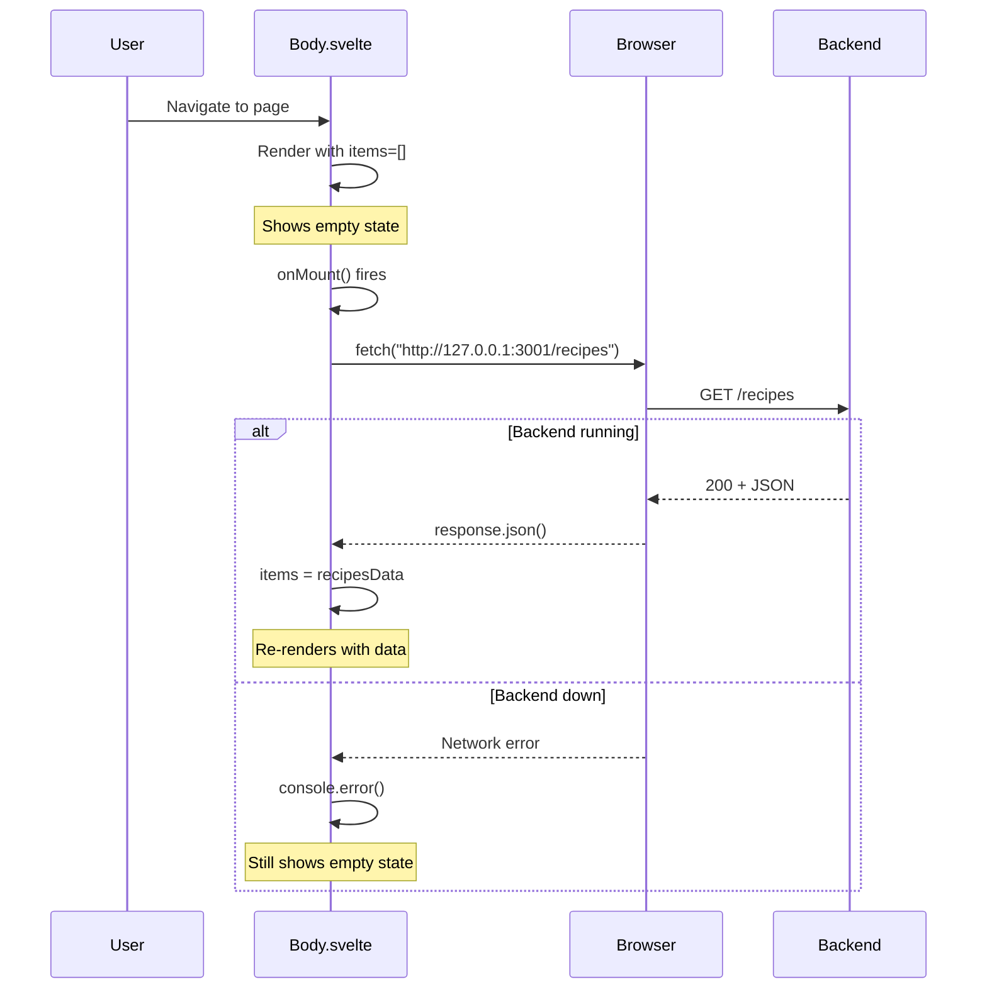
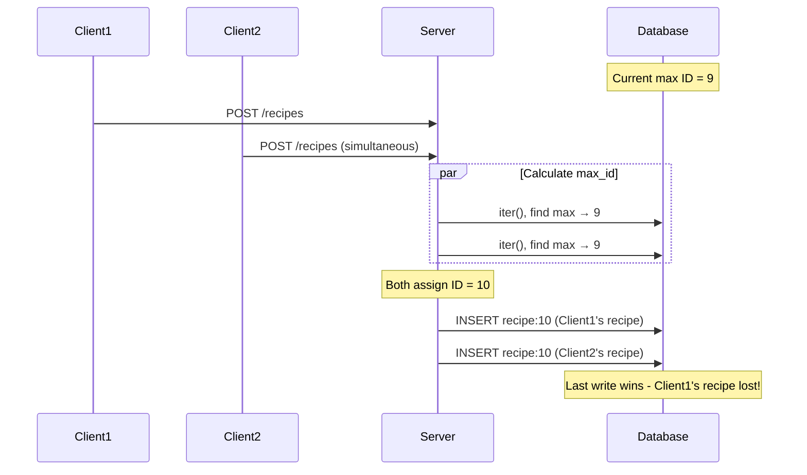
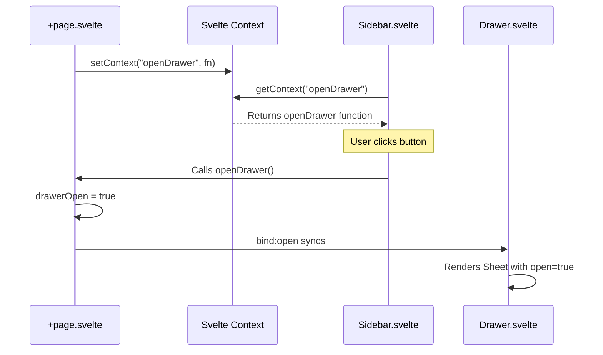
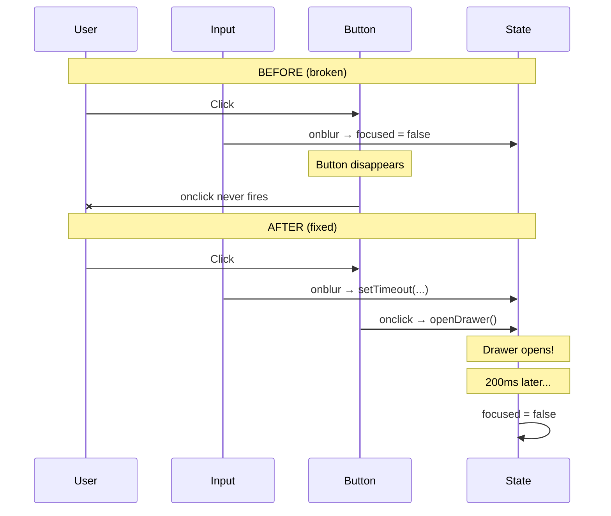
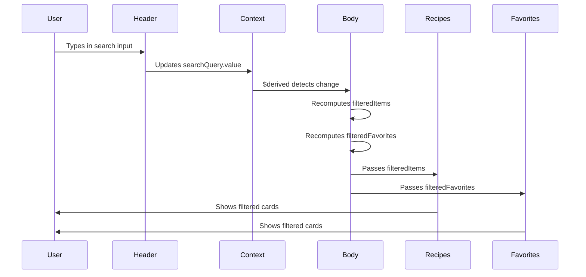

# Teacher Session Logs

This file contains logs of all teaching sessions from the `/teach` agent. Each log includes a timestamp, summary, and the full teaching content.

## Table of Contents

- [2026-03-31 16:30 - Frontend - Real-Time Recipe Search with Reactive Filtering](#2026-03-31-1630---frontend---real-time-recipe-search-with-reactive-filtering)
- [2026-03-31 15:45 - Frontend - Connecting Frontend to Backend API](#2026-03-31-1545---frontend---connecting-frontend-to-backend-api)
- [2026-03-31 14:30 - Backend - Rust REST API with Axum and Sled](#2026-03-31-1430---backend---rust-rest-api-with-axum-and-sled)
- [2026-03-29 17:00 - Frontend - Blur/Click Race Condition Fix](#2026-03-29-1700---frontend---blurclick-race-condition-fix)
- [2026-03-29 16:30 - Frontend - Drawer Component with Svelte Context](#2026-03-29-1630---frontend---drawer-component-with-svelte-context)
- [2026-03-29 15:45 - Frontend - Component Extraction](#2026-03-29-1545---frontend---component-extraction)

---

# [2026-03-31 15:45] [Frontend] Connecting Frontend to Backend API

**Timestamp:** 2026-03-31 15:45  
**Category:** Frontend  
**Summary:** Migrating from static JSON imports to dynamic API fetching with onMount(), refactoring shared types into models folder, and connecting Svelte frontend to Rust backend  

---

Teaching Session: Connecting Frontend to Backend API

## Lens 1: The What

We just migrated the frontend from loading recipes from a static JSON file to fetching them dynamically from the Rust backend API. The `Body.svelte` component now uses Svelte's `onMount()` lifecycle hook to make an HTTP request to `http://127.0.0.1:3001/recipes` when the component initializes. To support this change, we also restructured the type system by creating a shared `Recipe` interface in `src/lib/models/recipes.interface.ts` and updating all components (`Body.svelte`, `Recipes.svelte`, `Favorites.svelte`) to import from this single source of truth.

---

## Lens 2: The Why

| Decision Made | Why This Approach | What Was Rejected & Why |
|---|---|---|
| Use `onMount()` for data fetching | Svelte lifecycle hook that runs once when component is added to DOM. Guarantees fetch happens client-side after SSR. | Top-level `await` in script — blocks component rendering; `setInterval` polling — unnecessary overhead |
| Fetch in Body.svelte (parent) | Single fetch point, data flows down to child components. Easier to manage loading states and errors. | Fetch in Recipes/Favorites separately — duplicate API calls, harder to coordinate state |
| Separate `models/` folder structure | Scales better as more types are added (users, comments, etc). Clear separation between types and components. | Keep types inline in components — violates DRY, harder to maintain consistency |
| Name file `recipes.interface.ts` | Explicit naming convention indicates it's a type definition, not implementation code. | `recipes.ts` or `types.ts` — ambiguous, could be confused with service/utility files |
| Type arrays as `$state<Recipe[]>([])` | TypeScript needs explicit type annotation when initializing empty arrays, otherwise infers `never[]`. | No type annotation — TypeScript error: "Type 'any[]' not assignable to 'never[]'" |
| Remove JSON import entirely | Backend is now source of truth. Eliminates data duplication and sync issues. | Keep JSON as fallback — adds complexity, defeats purpose of backend |

**Code showing the migration from static to dynamic:**

```typescript
// BEFORE: Static JSON import
import recipesData from "../../../resources/recipes.json";
let items = $state([...recipesData].sort(...));

// AFTER: Dynamic API fetch
import type { Recipe } from "$lib/models/recipes.interface";

let items = $state<Recipe[]>([]);  // ← Must type as Recipe[], not []

onMount(async () => {
    const response = await fetch("http://127.0.0.1:3001/recipes");
    const recipesData: Recipe[] = await response.json();
    items = [...recipesData].sort(...);
});
```

**Why centralize the Recipe interface:**

```typescript
// BEFORE: Duplicated type definitions
// Body.svelte
interface Recipe { id: number; title: string; ... }

// Recipes.svelte  
interface Recipe { id: number; title: string; ... }

// Favorites.svelte
let { favorites }: { favorites: { id: number; title: string; ... }[] } = $props();

// AFTER: Single source of truth
// models/recipes.interface.ts
export interface Recipe { id: number; title: string; ... }

// All components
import type { Recipe } from "$lib/models/recipes.interface";
```

---

## Lens 3: Edge Cases & Assumptions

```
ASSUMPTION: Backend server is running when frontend loads
RISK: If backend isn't running on port 3001, fetch fails silently (recipes never load)
→ Current behavior: console.error logs, but UI shows empty state with no user feedback
→ User experience: Looks like there are no recipes (confusing)

EDGE CASE: What if the backend returns 500 or times out?
→ Current behavior: catch block logs error, arrays stay empty []
→ No loading spinner, no error message to user
→ Consider: Add loading state and error UI

EDGE CASE: What if backend response doesn't match Recipe interface?
→ Current behavior: TypeScript trusts the type assertion (const recipesData: Recipe[] = ...)
→ Runtime: Type mismatches could cause errors in child components
→ Consider: Add runtime validation with zod or similar

ASSUMPTION: Recipes load fast enough that users don't notice
RISK: Slow network or large dataset causes blank screen while loading
→ Current behavior: Empty arrays render immediately, then update when data arrives
→ User sees: Flash of empty state, then recipes pop in (jarring)
→ Solution: Add skeleton loading states

EDGE CASE: What if user navigates away before fetch completes?
→ Current behavior: Fetch continues, setState called on unmounted component
→ Svelte handles this gracefully (no memory leak), but wastes bandwidth
→ Better approach: AbortController to cancel fetch

ASSUMPTION: Recipe IDs are unique and stable across API calls
RISK: If backend returns different IDs on each call, Svelte's {#each} keying breaks
→ Impact: Drag-and-drop state gets confused, animations glitch
→ Current backend: Uses stable IDs from Sled, safe
```

**Code showing the error handling gap:**

```typescript
onMount(async () => {
    try {
        const response = await fetch("http://127.0.0.1:3001/recipes");
        if (!response.ok) throw new Error("Failed to fetch recipes");
        // ↑ Throws error but user never sees it
        
        const recipesData: Recipe[] = await response.json();
        // ↑ Type assertion, no validation that data actually matches
        items = [...recipesData].sort(...);
    } catch (error) {
        console.error("Error loading recipes:", error);
        // ↑ Only logs to console, no UI feedback
    }
});
```

**What's missing:**

```typescript
// Better approach with UI feedback
let loading = $state(true);
let error = $state<string | null>(null);

onMount(async () => {
    try {
        const response = await fetch("http://127.0.0.1:3001/recipes");
        if (!response.ok) throw new Error(`HTTP ${response.status}`);
        
        const recipesData: Recipe[] = await response.json();
        items = recipesData.sort(...);
    } catch (err) {
        error = err instanceof Error ? err.message : "Failed to load recipes";
    } finally {
        loading = false;
    }
});
```

**Sequence diagram showing the fetch lifecycle:**



---

## Lens 4: Codebase Connection

```
WHAT THIS AFFECTS:
  → Body.svelte (modified — now fetches from API, added onMount, typed state)
  → Recipes.svelte (modified — imports Recipe from models instead of inline definition)
  → Favorites.svelte (modified — imports Recipe from models, cleaner props type)
  → models/recipes.interface.ts (created — centralized type definition)
  → recipes.json (still exists — backend uses it for seeding, but frontend doesn't import it anymore)
  → Backend API (depends on — must be running on port 3001 for frontend to work)

WHAT COULD BREAK IF THIS IS WRONG:
  → If backend URL changes (port, host, path) — frontend won't load data
  → If Recipe interface diverges from backend response — runtime errors
  → If Rust backend's serde rename changes (isFavorite ↔ is_favorite) — mismatch
  → If onMount runs during SSR — fetch would fail (but Svelte handles this)
  → If multiple components try to fetch — race conditions, duplicate requests

WHAT THIS DOES NOT AFFECT (but looks like it might):
  → Server-side rendering — fetch only runs client-side in onMount
  → Other routes/pages — Body.svelte is specific to the recipes page
  → Drag-and-drop logic — still works exactly the same, just data source changed
  → Backend data persistence — frontend reads only, doesn't modify yet
```

**File structure showing the reorganization:**

```
packages/frontend/src/
├── lib/
│   ├── models/
│   │   └── recipes.interface.ts  (NEW - shared type)
│   └── components/
│       └── Body/
│           ├── Body.svelte        (MODIFIED - added fetch)
│           ├── Recipes.svelte     (MODIFIED - updated import)
│           └── Favorites.svelte   (MODIFIED - updated import)
└── resources/
    └── recipes.json               (UNCHANGED - still used by backend seed)
```

**Data flow before and after:**

```
BEFORE (static):
┌──────────────┐
│ recipes.json │
└──────┬───────┘
       │ (import at build time)
       ▼
┌──────────────┐
│ Body.svelte  │
└──────┬───────┘
       │ (pass as props)
       ├──────────────┐
       ▼              ▼
┌────────────┐  ┌────────────┐
│  Recipes   │  │ Favorites  │
└────────────┘  └────────────┘

AFTER (dynamic):
┌──────────────┐
│ recipes.json │ (backend only)
└──────────────┘
       
┌──────────────┐
│ Rust Backend │ (port 3001)
│  Sled DB     │
└──────┬───────┘
       │ HTTP GET /recipes
       ▼
┌──────────────┐
│ Body.svelte  │ (onMount fetch)
└──────┬───────┘
       │ (pass as props)
       ├──────────────┐
       ▼              ▼
┌────────────┐  ┌────────────┐
│  Recipes   │  │ Favorites  │
└────────────┘  └────────────┘
```

---

## Lens 5: Concepts to Own

**CONCEPT: Svelte Lifecycle - onMount()**
  What it is: Hook that runs once when a component is first inserted into the DOM. Async-friendly for data fetching.
  
  Why it matters here: Guarantees fetch happens client-side after SSR completes. If you fetched at top-level, it would run during server-side rendering and fail (no `fetch` in Node without polyfills).
  
  Code example:
  ```typescript
  // Top-level fetch (WRONG for SSR)
  const response = await fetch("...");  // Fails during SSR
  
  // onMount (CORRECT)
  onMount(async () => {
      const response = await fetch("...");  // Only runs in browser
      // No need to cleanup, automatically handled
  });
  ```
  
  Pattern: Use `onMount` for:
  - API calls
  - Browser API access (localStorage, window)
  - Third-party library initialization
  
  Further reading: Svelte docs on "Lifecycle hooks"

---

**CONCEPT: TypeScript Type Assertions vs Type Annotations**
  What it is: Type assertion (`as Type`) tells compiler "trust me", annotation (`: Type`) adds compile-time checking for assignments.
  
  Why it matters here: `await response.json()` returns `any`. We use assertion to claim it's `Recipe[]`, but there's no runtime validation.
  
  Code example:
  ```typescript
  // Type assertion (what we did)
  const recipesData: Recipe[] = await response.json();
  // Compiler trusts this, no validation
  
  // vs Type annotation on variable declaration
  let items: Recipe[] = [];  // Compiler enforces future assignments
  items = recipesData;       // Must match Recipe[] shape
  
  // Runtime validation (better approach)
  import { z } from 'zod';
  const RecipeSchema = z.object({ id: z.number(), ... });
  const recipesData = RecipeSchema.array().parse(await response.json());
  // ↑ Throws if data doesn't match schema
  ```
  
  Trade-off: Assertions are convenient but unsafe. Consider validation for external APIs.

---

**CONCEPT: $state() Type Inference**
  What it is: Svelte 5 rune for reactive state. TypeScript infers type from initial value.
  
  Why it matters here: Empty array `[]` infers as `never[]` — a type that can never hold elements. Must explicitly type with generics.
  
  Code example:
  ```typescript
  // Bad: TypeScript infers never[]
  let items = $state([]);
  items = recipesData;  // ERROR: Recipe[] not assignable to never[]
  
  // Good: Explicit generic type
  let items = $state<Recipe[]>([]);
  items = recipesData;  // OK
  
  // Alternative: Initialize with data
  let items = $state([...recipesData]);  // Infers Recipe[] from data
  ```
  
  Rule: Always type `$state` when initializing with empty arrays/objects.

---

**CONCEPT: Single Responsibility Principle - Type Definitions**
  What it is: Each module should have one reason to change. Type definitions are separate from component logic.
  
  Why it matters here: Recipe interface was duplicated across 3 files. If backend changes field name, you'd need to update 3 places (error-prone).
  
  Code example:
  ```typescript
  // BEFORE: Duplication
  // Body.svelte
  interface Recipe { id: number; ... }
  
  // Recipes.svelte
  interface Recipe { id: number; ... }  // Copy-paste
  
  // Backend changes "isFavorite" → "is_favorite"
  // Now you have to update 3 files!
  
  // AFTER: Single source of truth
  // models/recipes.interface.ts
  export interface Recipe { id: number; ... }
  
  // All components import
  import type { Recipe } from "$lib/models/recipes.interface";
  
  // Backend changes? Update 1 file, all consumers get the change.
  ```
  
  Pattern: Extract shared types to separate files. Name clearly (`.interface.ts` for types).

---

**CONCEPT: Fetch API Error Handling**
  What it is: `fetch()` only rejects on network errors, not HTTP errors (404, 500). Must manually check `response.ok`.
  
  Why it matters here: If backend returns 500, fetch doesn't throw — you get a response object with `ok: false`.
  
  Code example:
  ```typescript
  // Common mistake
  try {
      const response = await fetch(url);
      const data = await response.json();  // Works even if status 500!
      // ↑ Backend error response gets treated as valid data
  } catch (error) {
      // Never runs for HTTP errors, only network failures
  }
  
  // Correct pattern
  try {
      const response = await fetch(url);
      if (!response.ok) {  // ← Check status code
          throw new Error(`HTTP ${response.status}: ${response.statusText}`);
      }
      const data = await response.json();
  } catch (error) {
      // Now catches both network errors AND HTTP errors
  }
  ```
  
  Best practice: Always check `response.ok` before parsing body.

---

**CONCEPT: File System-Based Organization vs Flat Structure**
  What it is: Organizing related files into folders vs keeping them all in one directory.
  
  Why it matters here: As project grows, you'll have user interfaces, comment interfaces, etc. Flat structure becomes unwieldy.
  
  Structure comparison:
  ```
  BAD (flat):
  src/lib/
    recipes.interface.ts
    users.interface.ts
    comments.interface.ts
    recipes.service.ts
    users.service.ts
    ...  (50+ files)
  
  GOOD (organized):
  src/lib/
    models/
      recipes.interface.ts
      users.interface.ts
      comments.interface.ts
    services/
      recipes.service.ts
      users.service.ts
    components/
      ...
  ```
  
  Naming convention: `*.interface.ts` for types, `*.service.ts` for API logic, `*.util.ts` for helpers.

---

## Lens 6: Check-In Questions

Before you move on, make sure you can answer these:

1. **Why does `let items = $state([])` cause a TypeScript error, and how does adding `<Recipe[]>` fix it?**  
   (Hint: Think about what type TypeScript infers from an empty array)

2. **If the backend server crashes while the frontend is running, what happens when you refresh the page? What does the user see?**  
   (Hint: Trace through the onMount fetch, the catch block, and what's rendered with empty arrays)

3. **Why did we move the Recipe interface to a separate file instead of just importing it from Recipes.svelte into Body.svelte?**  
   (Hint: What happens when a third component needs the Recipe type?)

4. **What would break if the backend changed the JSON response from `"isFavorite"` to `"is_favorite"` without updating the frontend?**  
   (Hint: Think about Rust's `#[serde(rename)]` and JavaScript property access)

---

## Code Quality Notes

🔴 **CRITICAL**: No loading or error UI  
   Where: Body.svelte, onMount fetch block  
   Why this matters: Users see blank screen during load, no feedback if backend is down  
   Fix: Add loading state and error message display  
   
   **Add this:**
   ```typescript
   let loading = $state(true);
   let error = $state<string | null>(null);
   
   // In template
   {#if loading}
       <p>Loading recipes...</p>
   {:else if error}
       <p class="text-red-500">{error}</p>
   {:else}
       <!-- Existing Favorites/Recipes components -->
   {/if}
   ```

🟡 **WORTH ADDRESSING**: No runtime validation of API response  
   Where: `const recipesData: Recipe[] = await response.json()`  
   Trade-off: Type assertion trusts backend, but malformed data causes runtime errors  
   Consider: Add Zod schema validation  
   
   **Better approach:**
   ```typescript
   import { z } from 'zod';
   
   const RecipeSchema = z.object({
       id: z.number(),
       title: z.string(),
       description: z.string(),
       image: z.string().url(),
       isFavorite: z.boolean()
   });
   
   const recipesData = RecipeSchema.array().parse(await response.json());
   // Throws descriptive error if data doesn't match
   ```

🟡 **WORTH ADDRESSING**: Hardcoded API URL  
   Where: `fetch("http://127.0.0.1:3001/recipes")`  
   Trade-off: Can't change backend URL without editing code  
   Consider: Environment variable or config file  
   
   **Better approach:**
   ```typescript
   // vite.config.ts or .env
   const API_URL = import.meta.env.VITE_API_URL || "http://127.0.0.1:3001";
   
   // Body.svelte
   const response = await fetch(`${API_URL}/recipes`);
   ```

🟡 **WORTH ADDRESSING**: No fetch cancellation on unmount  
   Where: onMount async function  
   Trade-off: If user navigates away quickly, fetch completes and wastes bandwidth  
   Consider: AbortController pattern  
   
   **Better approach:**
   ```typescript
   onMount(() => {
       const controller = new AbortController();
       
       fetch(url, { signal: controller.signal })
           .then(/* ... */);
       
       return () => controller.abort();  // Cleanup on unmount
   });
   ```

🟢 **MINOR**: Could extract fetch logic to service  
   Where: Body.svelte onMount  
   Consider: Create `services/recipes.service.ts` for reusability  
   But: Only one component fetches recipes currently — premature abstraction

---

**You're ready to move on when you can confidently answer the check-in questions.**

---

# [2026-03-31 14:30] [Backend] Rust REST API with Axum and Sled

**Timestamp:** 2026-03-31 14:30  
**Category:** Backend  
**Summary:** Building a REST API with Axum web framework and Sled embedded database, including automatic seeding and CORS configuration  

---

Teaching Session: Rust Backend with Axum and Sled

## Lens 1: The What

We just built a complete REST API backend in Rust using Axum (web framework) and Sled (embedded NoSQL database). The server runs on port 3001 and exposes two endpoints: **GET /recipes** (returns all recipes) and **POST /recipes** (creates new recipes with auto-generated IDs). On first startup, it automatically seeds the database from the frontend's `recipes.json` file using Rust's `include_str!` macro. The database persists to disk in a `recipes.db` file, so recipes survive server restarts. CORS is enabled to allow the frontend (running on a different port) to make API calls.

---

## Lens 2: The Why

| Decision Made | Why This Approach | What Was Rejected & Why |
|---|---|---|
| Axum web framework | Modern, type-safe, built on Tokio. Excellent ergonomics with extractors (State, Json). Fast and production-ready. | Express.js-style framework — would require Node.js backend; Actix-web — more complex, steeper learning curve |
| Sled embedded database | Zero-config, no separate database server needed. Perfect for learning and prototyping. Persistent storage across restarts. | SQLite — requires SQL knowledge, more setup for async Rust; In-memory HashMap — loses data on restart |
| `include_str!` for seeding | Bundles JSON directly into binary at compile time. No file I/O at runtime, simpler deployment. | Reading file at runtime with `std::fs` — can fail if file path wrong, requires careful path handling |
| Tokio async runtime | Axum requires async, Tokio is the de facto standard. Handles concurrent requests efficiently. | Blocking sync code — can't use Axum; async-std — less ecosystem support |
| Auto-increment ID generation | Simple pattern: find max ID, add 1. Good enough for learning project with single server instance. | UUID — more complex, overkill for this use case; Database-generated IDs — Sled doesn't have auto-increment built-in |
| Tower CORS layer | Middleware pattern, composable. `Any` allows all origins for development simplicity. | Manual CORS headers — error-prone, more code; No CORS — frontend can't call API from different port |

**Code showing the technology stack:**

```rust
// Axum for routing and handlers
let app = Router::new()
    .route("/recipes", get(get_recipes))    // Type-safe routing
    .route("/recipes", post(create_recipe))
    .layer(cors)                             // Middleware pattern
    .with_state(state);                      // Shared state across handlers

// Tokio async runtime
#[tokio::main]  // Macro that sets up async runtime
async fn main() {
    // ... async code ...
}
```

**Why Sled over traditional databases:**

```rust
// Sled - just works, no server needed
let db = sled::open("recipes.db").expect("Failed to open database");

// vs. MongoDB/PostgreSQL - requires:
// - Separate server process running
// - Connection string configuration
// - Network error handling
// - More complex dependencies
```

---

## Lens 3: Edge Cases & Assumptions

```
ASSUMPTION: Single server instance (no distributed writes)
RISK: Auto-increment ID generation uses max(existing IDs) + 1. If multiple servers write simultaneously, ID collisions possible.
→ Current behavior: Would overwrite existing recipe with same ID
→ Is this safe? Yes for development/learning. No for production multi-server setup.

ASSUMPTION: recipes.json is valid and present at compile time
RISK: If recipes.json has syntax errors or is missing, compilation fails with include_str! error
→ Current behavior: Build fails, won't produce binary
→ Fail-safe: Better to fail at compile time than runtime

EDGE CASE: What if Sled database file is corrupted?
→ Current behavior: `.expect("Failed to open database")` panics on startup
→ No recovery mechanism - server won't start
→ Manual fix: Delete recipes.db file, restart (will re-seed)

EDGE CASE: What happens if two clients POST at the exact same time?
→ Current behavior: Both calculate same max_id, both try to insert same key
→ Sled behavior: Last write wins (no transaction isolation here)
→ Result: One recipe might be lost

EDGE CASE: Database already seeded - what if recipes.json changes?
→ Current behavior: `if db.len() > 0` just skips seeding
→ Manual updates to recipes.json won't reflect in database
→ Workaround: Delete recipes.db to force re-seed
```

**Code showing the seeding assumption:**

```rust
async fn seed_database(db: &sled::Db) {
    // Only seeds if database is empty
    if db.len() > 0 {
        println!("✅ Database already seeded");
        return;  // ← Skips seeding even if recipes.json changed
    }
    // ...
}
```

**Sequence diagram showing potential race condition:**



---

## Lens 4: Codebase Connection

```
WHAT THIS AFFECTS:
  → Cargo.toml (modified — added 6 dependencies: axum, tokio, sled, serde, serde_json, tower-http)
  → main.rs (created — entire REST API implementation from scratch)
  → recipes.json (depends on — compiled into binary via include_str!)
  → Frontend (will connect to — CORS allows cross-origin requests from Svelte app)

WHAT COULD BREAK IF THIS IS WRONG:
  → Frontend API calls — If CORS not configured, browser blocks requests
  → Database persistence — If recipes.db file permissions wrong, can't write to disk
  → Serialization — If Recipe struct doesn't match JSON shape, serde fails at runtime
  → Port conflicts — If another process uses 3001, server can't bind

WHAT THIS DOES NOT AFFECT (but looks like it might):
  → Frontend's recipes.json — Database is separate copy; changes to JSON require re-seed
  → Other Rust projects — This is workspace-scoped, doesn't pollute global Cargo registry
  → Backend tests — No test files created yet (would need #[cfg(test)] modules)
```

**Data flow architecture:**

```
┌─────────────────┐
│ recipes.json    │ (compile-time only, via include_str!)
└────────┬────────┘
         │ (first startup)
         ▼
┌─────────────────┐
│   recipes.db    │◄────┐ (persistent storage)
│  (Sled NoSQL)   │     │
└────────┬────────┘     │
         │              │
         │ read/write   │ write
         ▼              │
┌─────────────────┐     │
│  Axum Server    │─────┘
│  (port 3001)    │
└────────┬────────┘
         │ HTTP (JSON)
         │ + CORS headers
         ▼
┌─────────────────┐
│ Svelte Frontend │
│  (port 5173)    │
└─────────────────┘
```

**File structure:**

```
packages/backend/
├── Cargo.toml          (dependencies, project metadata)
├── src/
│   └── main.rs         (all API code - 136 lines)
├── recipes.db/         (created at runtime by Sled)
│   └── [binary files]  (don't commit this!)
└── target/             (build artifacts)
    └── debug/backend   (compiled binary)
```

---

## Lens 5: Concepts to Own

**CONCEPT: Axum Extractors**
  What it is: Types that pull data from HTTP requests in a type-safe way. `State<AppState>` extracts shared app state, `Json<T>` parses request body into type `T`.
  
  Why it matters here: No manual JSON parsing or error handling. Axum does it for you.
  
  Code example:
  ```rust
  // Extractors go in function parameters
  async fn get_recipes(
      State(state): State<AppState>  // ← Extracts shared database
  ) -> Json<Vec<Recipe>> {           // ← Return type = JSON response
      // state.db is available, compiler guarantees it exists
      // ...
  }
  
  async fn create_recipe(
      State(state): State<AppState>,
      Json(recipe): Json<Recipe>     // ← Auto-parses request body to Recipe
  ) -> Json<Recipe> {
      // If JSON is invalid, Axum returns 400 error automatically
      // ...
  }
  ```
  
  Further reading: Axum docs on "Extractors"

---

**CONCEPT: Tokio Async Runtime**
  What it is: Asynchronous runtime that executes `async` functions. Instead of blocking threads waiting for I/O, Tokio switches tasks while waiting.
  
  Why it matters here: The server can handle thousands of concurrent requests with minimal threads. Each API call is async (network I/O), so Tokio multiplexes them efficiently.
  
  Code example:
  ```rust
  #[tokio::main]  // ← This macro transforms main() to run on Tokio runtime
  async fn main() {
      // All .await calls are non-blocking
      let listener = tokio::net::TcpListener::bind("127.0.0.1:3001")
          .await  // ← Doesn't block entire thread while binding
          .unwrap();
      
      axum::serve(listener, app)
          .await  // ← Handles requests concurrently
          .unwrap();
  }
  ```
  
  Without Tokio, you'd need thread pools and complex synchronization.

---

**CONCEPT: Sled Embedded Database**
  What it is: Key-value store that runs inside your process (no separate server). Data stored on disk as binary files in a directory.
  
  Why it matters here: Zero-config persistence. No PostgreSQL/MongoDB server to install or configure. Perfect for prototypes and learning.
  
  Code example:
  ```rust
  // Opens or creates a database at "recipes.db/"
  let db = sled::open("recipes.db").expect("Failed to open database");
  
  // Store a key-value pair (both are bytes)
  let key = b"recipe:1";
  let value = serde_json::to_vec(&recipe)?;  // Recipe → bytes
  db.insert(key, value)?;
  
  // Retrieve and deserialize
  if let Some(bytes) = db.get(b"recipe:1")? {
      let recipe: Recipe = serde_json::from_slice(&bytes)?;
  }
  
  // Iterate over all keys
  for item in db.iter() {
      let (key, value) = item?;
      // ...
  }
  ```
  
  Trade-off: Sled is single-machine only. Can't scale to multiple servers like MongoDB.

---

**CONCEPT: Serde Serialization**
  What it is: Framework for converting Rust structs to/from formats like JSON. Uses derive macros to auto-generate conversion code.
  
  Why it matters here: The `Recipe` struct matches the JSON shape. `#[serde(rename = "isFavorite")]` bridges Rust naming (snake_case) to JavaScript (camelCase).
  
  Code example:
  ```rust
  #[derive(Serialize, Deserialize)]  // ← Generates JSON conversion code
  struct Recipe {
      id: u32,
      title: String,
      description: String,
      image: String,
      #[serde(rename = "isFavorite")]  // ← JSON uses "isFavorite"
      is_favorite: bool,                // ← Rust uses is_favorite
  }
  
  // JSON → Rust
  let recipe: Recipe = serde_json::from_str(r#"{"id":1,"title":"...","isFavorite":true}"#)?;
  
  // Rust → JSON
  let json = serde_json::to_string(&recipe)?;
  // Result: {"id":1,"title":"...","isFavorite":true}
  ```

---

**CONCEPT: Tower Middleware Layers**
  What it is: Composable middleware that wraps request handlers. Middleware can modify requests/responses, add headers, handle errors, etc.
  
  Why it matters here: CORS layer adds `Access-Control-Allow-Origin: *` header to all responses. Without this, browsers block cross-origin fetch() calls from the frontend.
  
  Code example:
  ```rust
  let cors = CorsLayer::new()
      .allow_origin(Any)      // Allow requests from any origin
      .allow_methods(Any)     // Allow all HTTP methods (GET, POST, etc)
      .allow_headers(Any);    // Allow all headers
  
  let app = Router::new()
      .route("/recipes", get(get_recipes))
      .layer(cors);  // ← Wraps all routes with CORS middleware
  
  // Request flow:
  // 1. Request arrives
  // 2. CORS layer checks origin, adds headers
  // 3. Route handler executes (get_recipes)
  // 4. CORS layer adds headers to response
  // 5. Response sent to client
  ```
  
  Without `.layer(cors)`, you'd see browser errors like "CORS policy blocked request".

---

**CONCEPT: `include_str!` Compile-Time File Embedding**
  What it is: Macro that reads a file at compile time and embeds its contents as a string literal in the binary.
  
  Why it matters here: recipes.json becomes part of the executable. No runtime file I/O errors, no relative path issues, easier deployment.
  
  Code example:
  ```rust
  // At compile time, Rust reads the file (relative to src/main.rs)
  let recipes_json = include_str!("../../frontend/src/resources/recipes.json");
  
  // After compilation, this is equivalent to:
  let recipes_json = r#"[{"id":1,"title":"Spaghetti Bolognese",...}]"#;
  // The file content is baked into the binary!
  
  // vs. Runtime file reading:
  let recipes_json = std::fs::read_to_string("path/to/recipes.json")?;
  // ↑ Can fail if file missing, path wrong, permissions denied, etc.
  ```
  
  Trade-off: Changing recipes.json requires recompiling. Good for seed data, bad for frequently updated content.

---

## Lens 6: Check-In Questions

Before you move on, make sure you can answer these:

1. **Why does the server need `#[tokio::main]` and `async fn main()`? What would happen if you removed `async` from `main()`?**  
   (Hint: Look at what Axum's `serve()` returns and what `.await` does)

2. **If you delete the `recipes.db` folder and restart the server, what happens? What if you then modify recipes.json and restart again?**  
   (Hint: Trace through the `seed_database()` logic and the `if db.len() > 0` check)

3. **Why does `create_recipe()` need to mutate the `recipe` parameter with `Json(mut recipe): Json<Recipe>`? What would break if you removed `mut`?**  
   (Hint: Look at the line `recipe.id = max_id + 1`)

4. **What would happen if the frontend sent a POST request with `{"title": "Pizza"}` (missing other fields) to `/recipes`?**  
   (Hint: Serde deserialization requirements and Axum's error handling)

---

## Code Quality Notes

🟡 **WORTH ADDRESSING**: No error handling for database operations  
   Where: `get_recipes()` and `create_recipe()` both use `.expect()` for database operations  
   Trade-off: Server panics and crashes if database has issues  
   Consider: Return `Result<Json<...>, StatusCode>` and handle errors gracefully with 500 responses  
   
   **Current code:**
   ```rust
   db.insert(key.as_bytes(), value)
       .expect("Failed to insert recipe");  // ← Panics on error
   ```
   
   **Better approach:**
   ```rust
   db.insert(key.as_bytes(), value)
       .map_err(|_| StatusCode::INTERNAL_SERVER_ERROR)?;
   ```

🟡 **WORTH ADDRESSING**: Race condition in ID generation  
   Where: `create_recipe()` calculates max_id, then assigns  
   Trade-off: Concurrent POSTs might generate duplicate IDs (last write wins)  
   Consider: Use Sled's `generate_id()` method or atomic counters  
   
   **Better approach:**
   ```rust
   // Use Sled's built-in ID generation
   let id = db.generate_id()?;
   let key = format!("recipe:{}", id);
   ```

🟡 **WORTH ADDRESSING**: CORS allows all origins in production  
   Where: `CorsLayer::new().allow_origin(Any)`  
   Trade-off: Security risk - any website can call your API  
   Consider: In production, restrict to specific frontend origin  
   
   **Production-ready:**
   ```rust
   let cors = CorsLayer::new()
       .allow_origin("https://yourdomain.com".parse::<HeaderValue>().unwrap());
   ```

🟢 **MINOR**: No validation on recipe fields  
   Where: `create_recipe()` accepts any Recipe  
   Consider: Validate title is non-empty, image URL is valid format, etc.  
   But: Can be added later when requirements are clearer

🟢 **MINOR**: No DELETE or PATCH endpoints  
   Where: Router only has GET and POST  
   Consider: Add DELETE /recipes/:id and PATCH /recipes/:id for completeness  
   But: Not needed until frontend requires those features

---

**You're ready to move on when you can confidently answer the check-in questions.**

---

# [2026-03-29 15:45] [Frontend] Component Extraction

**Timestamp:** 2026-03-29 15:45  
**Category:** Frontend  
**Summary:** Understanding presentation vs. logic separation in Svelte components through extracting Recipes.svelte  

---

Teaching Session: Component Extraction - Recipes.svelte

## Lens 1: The What

We just refactored the Body component by extracting the "Recipes" section into its own dedicated component file (`Recipes.svelte`). Previously, `Body.svelte` contained both the Favorites section and the Recipes grid with all their markup and logic inline. Now `Body.svelte` acts as a container that orchestrates two child components: `Favorites` and `Recipes`. The recipes grid still has drag-and-drop functionality, but the implementation details now live in a separate, more focused component.

---

## Lens 2: The Why

| Decision Made | Why This Approach | What Was Rejected & Why |
|---|---|---|
| Extract to separate component | Single Responsibility Principle - each component has one job. Makes the codebase easier to navigate and test. | Keeping everything in Body.svelte - works but violates SRP; harder to maintain as features grow |
| Pass event handlers as props (`handleConsider`, `handleFinalize`) | Parent component (`Body`) owns the state and logic, child just presents it. Keeps data flow explicit and predictable. | Moving state into Recipes - creates duplication with Favorites; harder to coordinate between sections |
| Use `$props()` rune for typed props | Svelte 5 runes provide better type safety and clearer component API than the old `export let` syntax | `export let` - old Svelte 4 pattern, less type-safe, being phased out |
| Define Recipe interface in child component | The child knows what shape it needs; parent doesn't need to know internal type details | Shared type file - premature abstraction; only one component uses this interface currently |

The core principle here: **presentation vs. logic separation**. Body.svelte orchestrates (logic), child components present (UI).

---

## Lens 3: Edge Cases & Assumptions

```
ASSUMPTION: The Recipe interface matches the JSON data structure
RISK: If recipes.json changes shape (e.g., adds new required fields), this component won't know until runtime

ASSUMPTION: Event handlers will always be provided by the parent
RISK: If you try to use Recipes.svelte elsewhere without handlers, TypeScript will catch it, but you'll get a runtime error if handlers are undefined

EDGE CASE: What if items array is empty?
→ Current behavior: Shows an empty grid (no fallback message)
→ Is this intentional? Unlike Favorites which has an {:else} block for empty state, Recipes doesn't guide the user when there are no recipes

EDGE CASE: What if a recipe doesn't have an image?
→ Current behavior: Will show broken image or empty space
→ No fallback placeholder image defined

ASSUMPTION: Recipe IDs are unique and stable
RISK: The {#each} keying uses recipe.id - if IDs duplicate or change, drag-and-drop will break
```

---

## Lens 4: Codebase Connection

```
WHAT THIS AFFECTS:
  → Body.svelte (modified - now imports and renders Recipes component)
  → Recipes.svelte (created - new component file)
  → recipes.json (depends on - data source for recipe items)
  → svelte-dnd-action (depends on - drag-and-drop library)
  → Card components (depends on - UI primitives from shadcn-svelte)

WHAT COULD BREAK IF THIS IS WRONG:
  → Drag-and-drop between Recipes and Favorites - both sections coordinate through the parent's state
  → Any future feature that needs to filter/sort recipes - logic lives in Body, not Recipes
  → Type safety - if the Recipe interface diverges from actual JSON structure, runtime errors

WHAT THIS DOES NOT AFFECT (but looks like it might):
  → Favorites.svelte - completely independent component with its own types and handlers
  → The recipes.json file location - still loaded in Body.svelte at the parent level
  → Routing or page-level layout - this is just a presentation component
```

---

## Lens 5: Concepts to Own

```
CONCEPT: Component Composition
  What it is: Breaking UI into smaller, reusable pieces that combine to form larger interfaces
  Why it matters here: Body.svelte went from a 50-line monolith to a 20-line orchestrator. 
  Each child component is now easier to reason about, test, and reuse.
  Further reading: React "Thinking in Components" applies to Svelte too

CONCEPT: Props vs. Bindable State
  What it is: Props flow down (parent → child), bindables flow both ways ($bindable in Svelte 5)
  Why it matters here: Recipes uses one-way props because it doesn't need to modify state - 
  it just calls parent handlers. Favorites uses bind:favorites because it mutates state directly.
  This is a conscious choice about data ownership.

CONCEPT: TypeScript Interfaces for Component APIs
  What it is: Defining explicit types for what a component expects (its "contract")
  Why it matters here: The interface Recipe + interface Props makes it impossible to 
  pass wrong data to Recipes.svelte. The type error we fixed (id: number vs string) 
  was caught by TypeScript before we even ran the code.

CONCEPT: Svelte 5 Runes ($props, $state, $bindable)
  What it is: New reactivity primitives replacing export let, $:, and component bindings
  Why it matters here: `let { items, handleConsider, handleFinalize }: Props = $props()` 
  is the Svelte 5 way. It's more explicit, type-safe, and compiles to faster code than 
  the old export let pattern.
```

---

## Lens 6: Check-In Questions

Before you move on, make sure you can answer these:

1. **If you wanted to add a "clear all recipes" button, where would that logic live - in Body.svelte or Recipes.svelte? Why?**  
   (Hint: Think about who owns the `items` state)

2. **Why did we pass `handleConsider` and `handleFinalize` as props instead of defining them inside Recipes.svelte?**  
   (Hint: What would happen to the drag-and-drop state coordination between Recipes and Favorites?)

3. **What would break if we changed `id: number` to `id: string` in the Recipe interface?**  
   (Hint: Look at recipes.json and how the data flows from parent to child)

---

## Code Quality Notes

🟡 **WORTH ADDRESSING**: Missing empty state in Recipes  
   Where: Recipes.svelte, the {#each} block  
   Trade-off: Favorites has an {:else} placeholder for when it's empty. Recipes doesn't.  
   Consider: Add `{:else}<p>No recipes available</p>{/each}` for consistency  

🟡 **WORTH ADDRESSING**: No image fallback  
   Where: Recipes.svelte line 37, ` {
  drawerOpen = true;
});

// Children retrieve context (Header.svelte / Sidebar.svelte)
const openDrawer = getContext<() => void>("openDrawer");
```

**Instead of this (prop drilling):**
```typescript
// Would need to pass through every layer:
<MainContent openDrawer={() => drawerOpen = true} />
  <Header openDrawer={openDrawer} />  // Props everywhere
```

---

## Lens 3: Edge Cases & Assumptions

```
ASSUMPTION: Context is available when components mount
RISK: If Header or Sidebar renders before +page.svelte sets context, getContext returns undefined
→ Current behavior: Would throw runtime error "Cannot read properties of undefined"
→ Is this safe? Yes, because Svelte guarantees parent mounts before children in the component tree

ASSUMPTION: Only one drawer instance exists
RISK: If multiple Drawer components are rendered, they'll all bind to the same drawerOpen state
→ Current behavior: All drawers would open/close together
→ Is this intentional? Yes — we want a single shared drawer

EDGE CASE: What if user clicks "Add a Recipe" while drawer is already open?
→ Current behavior: Setting drawerOpen = true again does nothing (already true)
→ No visible issue, but no validation that it's already open
```

**Code showing the assumption:**

```typescript
// Header.svelte - assumes context exists
const openDrawer = getContext<() => void>("openDrawer");
// If context not set, openDrawer is undefined, onclick will fail
```

**Edge case: Multiple click sources coordinate through shared state:**

```mermaid
sequenceDiagram
    User->>Sidebar: Click "Add Recipe"
    Sidebar->>Context: Call openDrawer()
    Context->>+page.svelte: Set drawerOpen = true
    +page.svelte->>Drawer: bind:open updates
    Drawer->>User: Slides in
    Note over Drawer: User still sees drawer
    User->>Header: Click "Add Recipe" again
    Header->>Context: Call openDrawer()
    Context->>+page.svelte: Set drawerOpen = true (no-op)
```

---

## Lens 4: Codebase Connection

```
WHAT THIS AFFECTS:
  → +page.svelte (modified — manages drawer state, provides context)
  → Drawer.svelte (created — new component wrapping Sheet)
  → Header.svelte (modified — consumes context to open drawer)
  → Sidebar.svelte (modified — consumes context to open drawer)
  → Sheet components (depends on — UI primitives from shadcn-svelte)

WHAT COULD BREAK IF THIS IS WRONG:
  → If context key changes in +page but not in Header/Sidebar — runtime error
  → If Drawer is moved outside Sidebar.Provider — loses access to context
  → Future "Add Recipe" buttons won't work unless they also use getContext

WHAT THIS DOES NOT AFFECT (but looks like it might):
  → Body/Recipes/Favorites components — completely unaware of drawer
  → The actual recipe data in recipes.json — form doesn't save yet
  → Routing or navigation — drawer is UI-only, no route changes
```

**Architecture showing component relationships:**

```
+page.svelte (context provider, state owner)
    │
    ├─▶ Sidebar.Provider
    │       │
    │       ├─▶ AppSidebar (context consumer)
    │       │       └─ "Add Recipe" button
    │       │
    │       └─▶ MainContent
    │               └─▶ Header (context consumer)
    │                       └─ "Add Recipe" button
    │
    └─▶ Drawer (state consumer via bind:open)
            └─▶ Sheet (UI primitive)
```

---

## Lens 5: Concepts to Own

```
CONCEPT: Svelte Context API
  What it is: A way to share data/functions across component boundaries without 
  passing props through every layer. Like React Context, but simpler.
  Why it matters here: Header and Sidebar are deeply nested. Without context, 
  we'd need to pass openDrawer through Main, then Header, then Command components. 
  Context cuts through all that.
  
  Code example:
  ```typescript
  // Provider (parent)
  setContext("openDrawer", () => { drawerOpen = true });
  
  // Consumer (any descendant)
  const openDrawer = getContext<() => void>("openDrawer");
  ```
  
  Further reading: Svelte docs on "Context API"

CONCEPT: $bindable Rune
  What it is: Svelte 5's way to create two-way bindings. The parent can read 
  AND write the prop, the child can also write it.
  Why it matters here: +page.svelte controls drawerOpen, but Drawer.svelte 
  needs to close itself (e.g., when user clicks Cancel). bind:open creates 
  that two-way sync automatically.
  
  Code example:
  ```typescript
  // Child declares bindable prop
  let { open = $bindable(false) }: Props = $props();
  
  // Parent binds to it
  <Drawer bind:open={drawerOpen} />
  
  // Now both can mutate it:
  handleOpenChange(false) // Child sets it
  drawerOpen = true       // Parent sets it
  ```
  
  Further reading: Svelte 5 runes documentation on $bindable

CONCEPT: Component Wrapping Pattern
  What it is: Creating a domain-specific component that wraps a generic UI primitive
  Why it matters here: Sheet is generic (can be any slide-out content). 
  Drawer is specific to "add recipe." If we later want to change the add-recipe 
  form, we edit one file (Drawer.svelte), not everywhere Sheet is used.
  
  Code example:
  ```typescript
  // Generic primitive (Sheet)
  <Sheet.Root {open}>
    <Sheet.Content>...</Sheet.Content>
  </Sheet.Root>
  
  // Domain wrapper (Drawer)
  <Drawer bind:open={drawerOpen} />
  // Hides Sheet details, exposes recipe-specific API
  ```
```

**Sequence diagram showing context flow:**



---

## Lens 6: Check-In Questions

Before you move on, make sure you can answer these:

1. **Why did we use Svelte context instead of passing `openDrawer` as a prop through the component tree?**  
   (Hint: Think about how many components are between +page.svelte and Header.svelte)

2. **What would happen if you added a third "Add Recipe" button in the Body component but forgot to use `getContext("openDrawer")`?**  
   (Hint: Where does the openDrawer function come from?)

3. **Why is `$bindable` needed in Drawer.svelte's props, and what would break if you removed it?**  
   (Hint: Look at the Cancel button's onclick handler — what does it do?)

---

## Code Quality Notes

🟡 **WORTH ADDRESSING**: No form state management  
   Where: Drawer.svelte, the form inputs  
   Trade-off: Currently inputs have no `bind:value` — data isn't captured  
   Consider: Add `$state` variables for title/description/image and bind them to inputs. 
   Then `Add Recipe` button can actually do something with the data.
   
   **Missing code:**
   ```typescript
   let title = $state("");
   let description = $state("");
   let imageUrl = $state("");
   ```

🟡 **WORTH ADDRESSING**: No form validation  
   Where: Drawer.svelte, submit button  
   Trade-off: User can submit empty form or invalid URL  
   Consider: Add required validation, URL format checking, or disable submit until valid

🟡 **WORTH ADDRESSING**: Context type safety  
   Where: Header.svelte line 9, Sidebar.svelte line 5  
   Trade-off: `getContext<() => void>("openDrawer")` uses string key — typos possible  
   Consider: Export a const DRAWER_CONTEXT key from +page.svelte and import it. 
   Refactoring-safe and autocomplete-friendly.
   
   **Improvement:**
   ```typescript
   // +page.svelte
   export const DRAWER_CONTEXT = Symbol("openDrawer");
   setContext(DRAWER_CONTEXT, () => drawerOpen = true);
   
   // Header.svelte
   import { DRAWER_CONTEXT } from "../../routes/+page.svelte";
   const openDrawer = getContext(DRAWER_CONTEXT);
   ```

🟢 **MINOR**: Hardcoded form classes  
   Where: Drawer.svelte, input elements  
   Consider: Could extract to reusable Input/Textarea components from ui folder  
   But: Premature abstraction for a single form. Wait until you have 2-3 forms.

---

**You're ready to move on when you can confidently answer the check-in questions.**

---

# [2026-03-29 17:00] [Frontend] Blur/Click Race Condition Fix

**Timestamp:** 2026-03-29 17:00  
**Category:** Frontend  
**Summary:** Understanding browser event timing and async patterns to fix race condition between blur and click events  

---

Teaching Session: Fixing the Blur/Click Race Condition

## Lens 1: The What

We just fixed a bug where clicking "Add a Recipe" in the Header's command palette didn't open the drawer. The issue was a **race condition between browser events**: when you clicked the button, the input's `blur` event fired first, immediately hiding the dropdown before the `click` event could register. The fix adds a 200ms delay to the blur handler using `setTimeout`, giving the click event time to fire and trigger `openDrawer()` before the Command.List disappears.

---

## Lens 2: The Why

| Decision Made | Why This Approach | What Was Rejected & Why |
|---|---|---|
| Use `setTimeout` delay in blur handler | Simple, works across browsers, gives click events time to fire. Standard pattern for dropdowns/menus. | Immediate blur (`focused = false`) — closes dropdown before click registers |
| 200ms delay specifically | Long enough for click to fire (usually <100ms), short enough users don't notice delay. Industry standard for this pattern. | Shorter delay (50ms) — might be too fast on slower devices; Longer (500ms) — visibly laggy |
| Keep blur handler entirely | Users need a way to close the dropdown (click outside, tab away). Can't just remove blur logic. | No blur handler — dropdown stays open forever; keyboard navigation breaks |
| Extract to named function `handleBlur` | Makes the setTimeout logic clear, adds inline comment explaining why. | Inline blur: `onblur={() => setTimeout(() => focused = false, 200)}` — harder to read, no comment space |

**Code showing the problem (before):**

```typescript
// This didn't work - race condition!
onblur={() => focused = false}  // Fires FIRST
onclick={openDrawer}             // Fires SECOND (but dropdown already hidden)
```

**The fix (after):**

```typescript
function handleBlur() {
  // Delay blur to allow click events to fire first
  setTimeout(() => {
    focused = false;  // Now this happens AFTER the click
  }, 200);
}

onblur={handleBlur}
```

---

## Lens 3: Edge Cases & Assumptions

```
ASSUMPTION: Click events fire within 200ms of blur
RISK: On extremely slow devices or under heavy CPU load, click might take >200ms
→ Current behavior: Dropdown would close, click wouldn't register
→ Is this acceptable? Yes — 200ms is generous; edge case is rare

ASSUMPTION: User only clicks once
RISK: If user rapidly clicks multiple times, each click resets the 200ms timer
→ Current behavior: Timer keeps resetting, dropdown stays open longer
→ Is this a problem? Minor UX quirk, but doesn't break functionality

EDGE CASE: What if user tabs away (keyboard blur) instead of clicking?
→ Current behavior: Still delays 200ms before closing
→ Is this intentional? Yes — consistent behavior, and 200ms isn't noticeable

EDGE CASE: What if openDrawer() itself is broken or undefined?
→ Current behavior: Click fires but throws error, dropdown closes after 200ms
→ Fail-safe: Dropdown still closes, doesn't stay stuck open
```

**Code showing the race condition timing:**

```typescript
// Browser event order:
User clicks button
  ↓
1. mousedown (on button)
2. blur (on input) ← focused = false immediately
3. mouseup (on button)
4. click (on button) ← but button is already hidden!

// With setTimeout fix:
User clicks button
  ↓
1. mousedown
2. blur → setTimeout schedules focused = false for 200ms later
3. mouseup
4. click → openDrawer() fires successfully
   ... 200ms passes ...
5. focused = false (dropdown closes)
```

**Sequence diagram showing the race condition:**



---

## Lens 4: Codebase Connection

```
WHAT THIS AFFECTS:
  → Header.svelte (modified — blur handler now delayed)
  → Command.List visibility (depends on — controlled by focused state)
  → Drawer opening (fixes — click now fires before dropdown hides)

WHAT COULD BREAK IF THIS IS WRONG:
  → If setTimeout delay is too short (e.g., 10ms) — race condition returns on slower devices
  → If setTimeout is removed entirely — back to original bug
  → If user has JavaScript disabled — setTimeout won't work (but blur/click don't either)

WHAT THIS DOES NOT AFFECT (but looks like it might):
  → Sidebar's "Add a Recipe" button — no blur logic needed there, already working
  → The Drawer component itself — unchanged, just opens successfully now
  → Search functionality — search value binding unaffected by blur timing
```

**ASCII diagram showing event flow:**

```
User Actions:
┌──────────────┐
│ Focus input  │
└──────┬───────┘
       │
       ▼
┌──────────────────┐
│ focused = true   │
│ Command.List     │◄─── Dropdown appears
│ shows button     │
└──────────────────┘
       │
       ▼
┌───────────────────┐
│ Click "Add..."    │
└────────┬──────────┘
         │
    ┌────┴────┐
    │         │
    ▼         ▼
[blur]    [click]
    │         │
    │         └──▶ openDrawer() ✓ Fires successfully!
    │
    └──▶ setTimeout(200ms)
              │
              ▼
         focused = false
         (dropdown closes)
```

---

## Lens 5: Concepts to Own

```
CONCEPT: Browser Event Order
  What it is: When multiple events trigger on related elements, browsers fire 
  them in a predictable sequence: mousedown → blur → mouseup → click.
  Why it matters here: Understanding this order explains why blur fires before click. 
  The blur happens during mousedown phase, but click happens after mouseup.
  
  Code example:
  ```typescript
  // Events fire in this order:
  onmousedown  // 1. Mouse pressed
  onblur       // 2. Focus leaves (we're here!)
  onmouseup    // 3. Mouse released
  onclick      // 4. Click registered (too late if element hidden)
  ```
  
  Further reading: MDN "Event order" documentation

CONCEPT: Race Condition
  What it is: When the outcome depends on timing/order of events, and 
  getting it wrong causes bugs. Classic concurrency issue.
  Why it matters here: Blur and click are "racing" — if blur wins, 
  it hides the button before click can fire. setTimeout fixes the race 
  by ensuring click always happens first.
  
  Code example:
  ```typescript
  // Race condition:
  onblur={() => focused = false}  // Fires at ~0ms
  onclick={openDrawer}             // Fires at ~50ms — LOST RACE
  
  // Fix the race:
  onblur={() => setTimeout(() => focused = false, 200)}
  // Blur schedules for 200ms, click fires at 50ms — WINS RACE
  ```

CONCEPT: Event Loop and setTimeout
  What it is: JavaScript executes code in a single thread. setTimeout 
  doesn't "pause" — it schedules a callback to run later after current 
  execution finishes.
  Why it matters here: setTimeout pushes the blur logic to the back of 
  the event queue, letting the click event execute first.
  
  Code example:
  ```typescript
  console.log("1. Event fires");
  setTimeout(() => {
    console.log("3. Runs 200ms later");
  }, 200);
  console.log("2. Runs immediately");
  // Output: 1, 2, 3 (not 1, 3, 2)
  ```
  
  Further reading: "JavaScript Event Loop" on MDN

CONCEPT: Common UI Pattern
  What it is: The "delayed blur for clickable dropdown items" pattern. 
  Used everywhere: autocomplete, command palettes, context menus.
  Why it matters here: This isn't a hack — it's the standard solution. 
  Libraries like Headless UI, Radix UI all use this pattern internally.
  
  Code example from the wild:
  ```typescript
  // Similar pattern in popular libraries:
  const handleBlur = () => {
    requestAnimationFrame(() => {  // Or setTimeout
      if (!menuRef.current?.contains(document.activeElement)) {
        closeMenu();
      }
    });
  };
  ```
```

---

## Lens 6: Check-In Questions

Before you move on, make sure you can answer these:

1. **Why does the blur event fire before the click event when you click a button inside a focused input's dropdown?**  
   (Hint: Think about the browser event sequence: mousedown → blur → mouseup → click)

2. **What would happen if we changed the setTimeout delay from 200ms to 10ms? Would it still work?**  
   (Hint: Click events usually fire within ~50-100ms, but what about slow devices?)

3. **Why can't we just remove the blur handler entirely to "fix" the problem?**  
   (Hint: How would users close the dropdown if they click outside or tab away?)

---

## Code Quality Notes

🟡 **WORTH ADDRESSING**: Magic number 200  
   Where: Header.svelte line 13  
   Trade-off: 200ms is hardcoded with no clear reasoning in code  
   Consider: Extract to a constant with meaningful name  
   
   **Improvement:**
   ```typescript
   const BLUR_DELAY_MS = 200; // Allow time for click events to fire
   
   function handleBlur() {
     setTimeout(() => {
       focused = false;
     }, BLUR_DELAY_MS);
   }
   ```

🟡 **WORTH ADDRESSING**: No cleanup of setTimeout  
   Where: Header.svelte line 12-15  
   Trade-off: If component unmounts during the 200ms delay, setTimeout still fires  
   Consider: Store timeout ID and clear on unmount (though 200ms is so short this is low-priority)
   
   **Pattern:**
   ```typescript
   let blurTimeout: ReturnType<typeof setTimeout> | null = null;
   
   function handleBlur() {
     blurTimeout = setTimeout(() => {
       focused = false;
     }, 200);
   }
   
   $effect(() => {
     return () => {
       if (blurTimeout) clearTimeout(blurTimeout);
     };
   });
   ```

🟢 **MINOR**: Could use requestAnimationFrame instead  
   Where: handleBlur function  
   Consider: Some libraries use `requestAnimationFrame` instead of `setTimeout(fn, 0)` for similar patterns  
   But: setTimeout with explicit delay is clearer about intent here

---

**You're ready to move on when you can confidently answer the check-in questions.**

---

# [2026-03-31 16:30] [Frontend] Real-Time Recipe Search with Reactive Filtering

**Timestamp:** 2026-03-31 16:30  
**Category:** Frontend  
**Summary:** Implementing real-time search functionality that filters recipe cards as the user types, using Svelte context API for state sharing and $derived rune for reactive filtering across Favorites and Recipes sections

---

## Teaching Session: Real-Time Recipe Search with Reactive Filtering

### Lens 1: The What

We just implemented a real-time search feature that filters recipe cards as you type. When you enter text in the search input at the top of the page, both the Favorites section and the Recipes section instantly filter to show only recipes whose titles match your search query. The filtering is case-insensitive and uses substring matching—typing "chick" shows "Chicken Parmesan", "Chicken Tikka Masala", etc. The search state lives in the root layout component and flows down through Svelte's context API to the Header (where you type) and Body (where cards get filtered).

---

### Lens 2: The Why

| Decision Made | Why This Approach | What Was Rejected & Why |
|---|---|---|
| Svelte context for state sharing | Avoids prop drilling through multiple component layers, keeps search state accessible to both Header and Body without coupling them | Passing props down through MainContent would create unnecessary coupling; global store would be overkill for single-page state |
| Getter/setter object in context | Allows two-way binding from Header while keeping reactivity working in Body's $derived | Plain string value wouldn't trigger reactivity properly when modified from different components |
| $derived rune for filtering | Automatically recomputes filtered arrays when searchQuery changes—no manual effect needed | Using $effect to manually update arrays is more verbose and error-prone; losing Svelte 5's reactive benefits |
| Filter at Body level, not components | Single source of truth for filtering logic; Favorites and Recipes stay presentational | Duplicating filter logic in both components violates DRY; harder to maintain consistent behavior |

**Code showing the context decision:**

```typescript
// +page.svelte - Provider sets up the context
let searchQuery = $state("");

setContext("searchQuery", {
  get value() {
    return searchQuery;  // When accessed, returns current value
  },
  set value(newValue: string) {
    searchQuery = newValue;  // When assigned, updates state
  }
});
```

Why this pattern? The getter/setter allows `bind:value={searchContext.value}` in Header to modify the state, while Body's `$derived` automatically reacts to reads.

**Code showing $derived reactivity:**

```typescript
// Body.svelte - Automatically recomputes when searchContext.value changes
let filteredItems = $derived(
  searchContext.value.trim() === ""
    ? items  // No search → show all
    : items.filter((recipe) =>
        recipe.title.toLowerCase().includes(searchContext.value.toLowerCase())
      )
);
```

This is cleaner than:

```typescript
// OLD APPROACH (Svelte 4 style - don't use)
$: filteredItems = searchContext.value.trim() === ""
  ? items
  : items.filter(...);  // Reactive statement syntax
```

The `$derived` rune is Svelte 5's explicit, type-safe way to declare derived state. It's more obvious what's happening.

---

### Lens 3: Edge Cases & Assumptions

**ASSUMPTION:** Context is always available when Header and Body mount  
**RISK:** If component tree structure changes and these components render outside the Provider, `getContext` returns undefined → runtime error

**Code showing the assumption:**
```typescript
// Header.svelte and Body.svelte both assume this succeeds
const searchContext = getContext<{ value: string }>("searchQuery");
// If context not set, searchContext is undefined ← RUNTIME ERROR when accessing .value
```

**EDGE CASE:** What happens with very large recipe lists (1000+ items)?  
→ Current behavior: Filters run on every keystroke; no debouncing  
→ Is this intentional? For <100 recipes, performance is fine. At scale, consider debouncing:

```typescript
// POTENTIAL OPTIMIZATION (not implemented):
import { debounce } from "$lib/utils";

let debouncedSearch = $state("");

const searchContext = getContext<{ value: string }>("searchQuery");
const debouncedUpdate = debounce((val: string) => debouncedSearch = val, 300);

$effect(() => {
  debouncedUpdate(searchContext.value);
});

// Then filter based on debouncedSearch instead
```

**EDGE CASE:** What if a recipe title is null or undefined?  
→ Current behavior: `.toLowerCase()` throws TypeError  
→ Is this intentional? We assume backend always provides valid titles. Add validation if data source is untrusted.

**ASSUMPTION:** Case-insensitive substring matching is sufficient  
**RISK:** User types "chkn tikka" expecting fuzzy match → no results  
Current code: `"Chicken Tikka".includes("chkn tikka")` → **false**  

**Data flow diagram:**



---

### Lens 4: Codebase Connection

**WHAT THIS AFFECTS:**

→ `packages/frontend/src/routes/+page.svelte` (modified — added searchQuery state and context provider)  
→ `packages/frontend/src/lib/components/Header.svelte` (modified — now reads/writes searchQuery via context)  
→ `packages/frontend/src/lib/components/Body/Body.svelte` (modified — added filteredItems and filteredFavorites derived state)  
→ `packages/frontend/src/lib/components/Body/Favorites.svelte` (modified — refactored from $bindable to accept filtered favorites as prop)  
→ `packages/frontend/src/lib/components/Body/Recipes.svelte` (depends on — already accepts items as prop, no changes needed)

**WHAT COULD BREAK IF THIS IS WRONG:**

→ If context key name changes ("searchQuery") but consumers don't update → runtime undefined error  
→ If Body.svelte filters wrong array (items vs favorites) → wrong cards disappear  
→ If drag-and-drop modifies filtered arrays instead of source arrays → data loss when search clears

**WHAT THIS DOES NOT AFFECT (but looks like it might):**

→ Drag-and-drop functionality — still operates on source `items` and `favorites` arrays, not filtered ones. Filtered arrays are read-only derived state.  
→ Backend API — search is entirely client-side; no network requests triggered  
→ Favorites toggle logic — not implemented yet; search doesn't interfere with future favoriting

**Component hierarchy:**

```
+page.svelte (context provider: searchQuery, openDrawer)
    │
    └─▶ MainContent
            └─▶ Header (consumes: searchQuery, writes to it)
            └─▶ Body (consumes: searchQuery, derives filtered arrays)
                    ├─▶ Favorites (receives: filteredFavorites)
                    └─▶ Recipes (receives: filteredItems)
```

---

### Lens 5: Concepts to Own

**CONCEPT: Svelte Context API**  
What it is: A key-value store for passing data down the component tree without props  
Why it matters here: Lets Header and Body share search state without MainContent knowing about it—decouples unrelated components  

**Code example:**
```typescript
// Provider (parent) - sets up context
setContext("searchQuery", { get value() { return searchQuery }, set value(v) { searchQuery = v } });

// Consumer (any descendant) - retrieves it
const searchContext = getContext<{ value: string }>("searchQuery");
// Now Header can write: searchContext.value = "pizza"
// And Body can read: searchContext.value in $derived
```

Context is **hierarchical**—only descendants of the provider can access it. Siblings cannot.

---

**CONCEPT: $derived Rune (Svelte 5 Reactivity)**  
What it is: Declares computed state that automatically updates when dependencies change  
Why it matters here: When `searchContext.value` changes, `filteredItems` automatically recomputes—no manual tracking needed  

**Code example:**
```typescript
let items = $state<Recipe[]>([...]); // Base state
let searchQuery = $state("");        // Base state

// Derived state - recalculates when items OR searchQuery changes
let filteredItems = $derived(
  searchQuery.trim() === ""
    ? items
    : items.filter(recipe => recipe.title.toLowerCase().includes(searchQuery.toLowerCase()))
);
```

**Comparison with old approach:**
```typescript
// Svelte 4 - reactive statement
$: filteredItems = items.filter(...);  // ← Re-runs when items changes

// Svelte 5 - explicit derived state
let filteredItems = $derived(items.filter(...));  // ← Same behavior, clearer intent
```

The difference: `$derived` is a **signal** that tells both the compiler and developers "this value depends on other state."

---

**CONCEPT: Getter/Setter Pattern for Two-Way Binding**  
What it is: An object with `get` and `set` methods that control access to a value  
Why it matters here: Allows `bind:value` in Header while keeping reactivity working in Body  

**Code example:**
```typescript
// Without getter/setter (doesn't work for two-way binding):
setContext("searchQuery", searchQuery); // ← Passes string value, not reference

// With getter/setter (works):
setContext("searchQuery", {
  get value() { return searchQuery },  // When read, returns current state
  set value(v) { searchQuery = v }     // When written, updates state
});
```

When Header does `bind:value={searchContext.value}`, Svelte:
1. Reads `searchContext.value` (calls the getter)
2. On input change, assigns `searchContext.value = newText` (calls the setter)
3. Setter updates the state, triggering $derived in Body

---

**CONCEPT: Array Filtering with .includes()**  
What it is: Case-insensitive substring search using JavaScript string methods  
Why it matters here: Simple, performant for small-to-medium datasets; no external library needed  

**Code example:**
```typescript
// The filtering logic broken down:
const searchTerm = "chick";                    // User typed this
const recipeTitle = "Chicken Parmesan";       // Recipe in database

// Step 1: Normalize to lowercase for case-insensitive comparison
const normalizedSearch = searchTerm.toLowerCase();    // "chick"
const normalizedTitle = recipeTitle.toLowerCase();    // "chicken parmesan"

// Step 2: Check if title contains search term
const matches = normalizedTitle.includes(normalizedSearch);  // true

// Step 3: Filter array
items.filter(recipe => recipe.title.toLowerCase().includes(searchTerm.toLowerCase()));
```

**Trade-offs:**

| Approach | Pros | Cons |
|----------|------|------|
| `.includes()` (current) | Simple, fast, no dependencies | Only substring match—no fuzzy matching |
| Fuzzy library (fuse.js) | Handles typos, ranks results | Adds ~10KB bundle size, overkill for simple search |
| Backend search | Scalable, can search all fields | Requires API call on every keystroke, latency |

---

**CONCEPT: Derived State vs. Source of Truth**  
What it is: Distinguishing between base state (source of truth) and computed/filtered views  
Why it matters here: Drag-and-drop modifies `items`, not `filteredItems`—filtered arrays are read-only views  

**Visualizing the data flow:**

```
Source State (mutable):
┌─────────────────┐
│ items = [A,B,C] │ ← onMount fetches from API
└────────┬────────┘
         │
         │ $derived (read-only)
         ▼
┌──────────────────────┐
│ filteredItems = [A,C]│ ← Computed view based on search
└──────────────────────┘
         │
         ▼
    <Recipes items={filteredItems} />  ← Displays filtered view
```

When you drag a recipe, the `handleFinalize` callback modifies `items`, **not** `filteredItems`. The filtered array then automatically recomputes.

---

### Lens 6: Check-In Questions

Before you move on, make sure you can answer these:

1. **What happens if you remove the `.trim()` check in the derived state?**  
   (Hint: Try typing a single space. What do you expect to see?)

2. **If you wanted to search both recipe titles AND descriptions, where would you change the code?**  
   (Hint: Look at the filtering logic in Body.svelte)

3. **Why did we pass `filteredFavorites` to the Favorites component instead of letting Favorites do its own filtering?**  
   (Hint: Think about where the search state lives and the DRY principle)

4. **What would break if you changed the context key from "searchQuery" to "search" in +page.svelte but forgot to update Header.svelte?**  
   (Hint: Consider what `getContext("search")` would return if the key doesn't exist)

---

### Code Quality Notes

**🟢 MINOR: Consider debouncing for scalability**  
Where: Body.svelte filtering logic  
Trade-off: Current implementation filters on every keystroke. For <100 items, this is fine and provides instant feedback.  
Consider: If recipe list grows to 1000+, add debouncing:

```typescript
import { debounce } from "$lib/utils";

let debouncedSearch = $state("");
const debouncedUpdate = debounce((val: string) => debouncedSearch = val, 300);

$effect(() => {
  debouncedUpdate(searchContext.value);
});

// Filter based on debouncedSearch instead of searchContext.value
```

**🟢 MINOR: Add null safety for recipe titles**  
Where: Body.svelte filter function  
Trade-off: We assume backend always provides valid titles (which it currently does)  
Consider: If data source becomes untrusted, add safety:

```typescript
items.filter((recipe) =>
  recipe.title?.toLowerCase().includes(searchContext.value.toLowerCase()) ?? false
)
```

**🟡 WORTH ADDRESSING: Context could be undefined**  
Where: Header.svelte and Body.svelte  
Why this matters: If component tree structure changes, `getContext` might return undefined  
Fix: Add runtime check:

```typescript
const searchContext = getContext<{ value: string }>("searchQuery");
if (!searchContext) {
  throw new Error("searchQuery context not found. Ensure component is inside Provider.");
}
```

Or use optional chaining with fallback:

```typescript
let filteredItems = $derived(
  (searchContext?.value ?? "").trim() === ""
    ? items
    : items.filter(...)
);
```

---

**You're ready to move on when you can confidently answer the check-in questions and explain why we chose Svelte context over props or a global store.**

---

